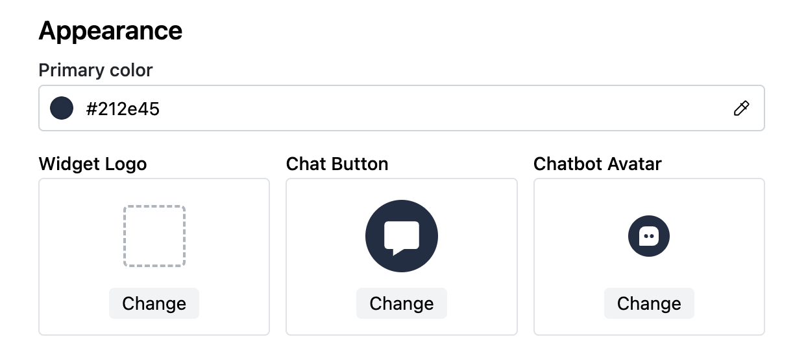
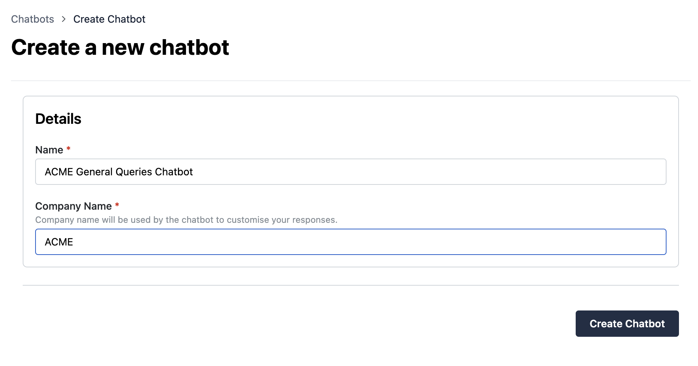

import video1 from "./assets/videos/source_citation.mov";

## AI Improvements

We are continually exploring ways to improve the effectiveness of our chatbots, allowing your customer agents to focus on more complex queries.

## Better Search Results

As part of its thought process, our chatbots generate a search query from each customer question they receive, and use this to search your websites & documents for an answer.

For example, if your customer asks “Why should I choose Algomo?”, the chatbot may generate a corresponding search query of “reasons to choose Algomo”, to increase the chances of finding relevant information.

We have improved further by generating multiple search queries (in the above example, the chatbot may generate “benefits of Algomo” and “Algomo advantages” as well). This increases the amount of relevant documentation that is searched by the chatbot, improving answer quality.

## AI Transparency

A common issue with chatbots is understanding how they arrived at their chosen answer. Our recent improvements provide a window into the decision process taken by our chatbots, providing some much needed transparency for your customers and customer service agents alike.

<!-- video -->

<video
  width="100%"
  controls
  style={{
    width: 400,
  }}>
  <source src={video1} />
</video>

- For every customer question, we now show the corresponding queries our chatbot used to search for answers
- We also show references to your websites & documents that the chatbot used to find its answer
- The chatbot queries and references are available to customers (via the chat widget) and customer agents _(in the conversations page)_

## UX Improvements

### Widget customisation

You can now customise more widget elements to fit your branding including the logo, chat button and chatbot avatar.

### Chatbot Creation

The chatbot creation page has had a minor refresh. We now also support overriding the company name for each individual chatbot, which is particularly useful for those that want to manage the chatbot experience for multiple brands or are agencies with multiple clients

