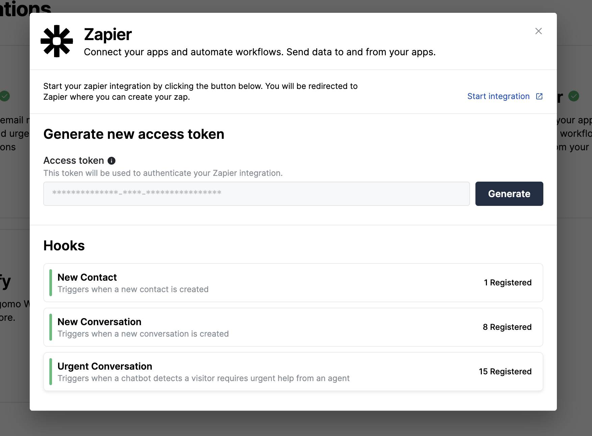

## Urgent notifications in Zapier

AI detection of urgent customer queries can now trigger your Zapier workflows. 10x your productivity and never miss an urgent enquiry again!

Forward urgent messages to Slack, add a note to OneNote or create a ticket in JIRA, the possibilities are limitless.

  
Improvements and Fixes

  - Conversations page refresh: various usability improvements and styling updates
  - Data source management: Intent management has been migrated to data sources

 
