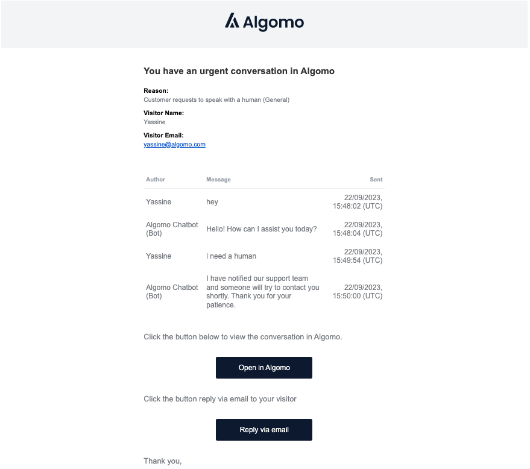

import tools_vid from "./assets/videos/tools-demo.mov";
import data_sources from "./assets/videos/data_sources.mov";

## Overview

### Features & Improvements

1. [Email notification improvements](#email)
2. [Simplified Data Source management](#datasources)
3. [Website scraping improvements](#scraping)

### Coming soon...

1. [AI Tools](#tools)
2. [Authenticated visitors](#auth)

---

<h2 id="email">Enhancements to Email Notifications</h2>

With our "Reply by Email" function, you can easily jump into a new email thread with all the necessary details already filled in, along with the conversation history to provide much needed context.
Replying directly to an email sends it straight to your customer, streamlining the communication process.

<h2 id="datasources">Easier Data Source Management</h2>

The link between data source and chatbots isn't always clear. We've listened to your feedback and made a couple of improvements!

When creating a new data source from the chatbot page, the newly created data source is now automatically assigned to the chatbot.
Automatically connecting data sources reduces the number of manual steps and speeds up the testing feedback loop for your chatbot.

Finally, browsing all of your data sources will now show which chatbots are using them.

<!-- video -->

<video
  width="100%"
  controls
  style={{
    width: 400,
  }}
>
  <source src={data_sources} />
</video>

<h2 id="scraping">Improved sitemap processing for Website Scraping</h2>

We now support [sitemap index files](https://developers.google.com/search/docs/crawling-indexing/sitemaps/large-sitemaps) when scraping websites.
These are common for very large websites, and help ensure we don't miss any of your pages while crawling your site.

<h2 id="tools">Enhance AI with Tools</h2>

**_Coming soon..._**

Do more than simply answer support questions. With tools, you can automate common support tasks!
Integrate with 3rd-party services or call your own internal APIs. Check on orders, book appointments or offer your customers product suggestions.

<!-- video -->

<video
  width="100%"
  controls
  style={{
    width: 400,
  }}
>
  <source src={tools_vid} />
</video>

<h2 id="auth">Verify the identity of your visitors</h2>

**_Coming soon..._**

Ensure conversations between you and your users are kept private with visitor authentication.
This will allow you to verify the identity of your customers when talking to you via the Algomo chat widget.
Particularly useful if you want to use our chat functionality on pages that are restriced to logged in users.

 

  
Bug Fixes

- Better handling of network disconnection in the chat widget
- Web scraping reliability improvements
- Fix uploading very large text file data sources
- Fix chatbot not always responding in the correct lanuage
- Reduce duplicated search results to provide more relevant content to the chatbot
- Fix support for large numbers of excluded URLs for website data sources

 
