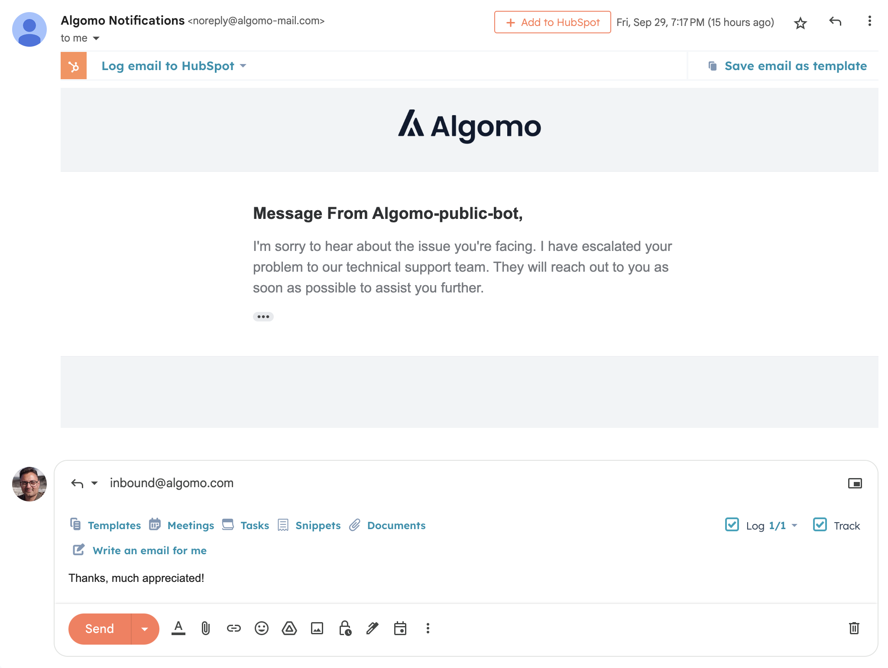

## Overview

### Features & Improvements

1. [Visitors Replies to Email](#visitor-email)
2. [Chat Widget Summary](#widget)

### Coming soon...

1. [Full email integration](#email)
2. [Tools...](#tools)

---

<h2 id="visitor-email">
  Visitors Can Now Pick Up Their Algomo Conversations Via Email
</h2>

Visitors have the capability to continue conversations they initiated via the widget over email. They can now reply straight from their email, and they will receive messages sent from the platform via email as well, ensuring they never miss one.

<h2 id="widget">Chat Widget Summary</h2>

Previously it hasn't always been clear which chatbot will handle conversations for a given widget.
We've listened to your feedback, and we now show which chatbot is assigned to your widgets on the new summary page.
We also show which data source your assigned chatbot has access to, along with their status, to make it easier to understand chatbot behaviour when testing.

<h2 id="email">Full Email Integration</h2>

**_Coming soon..._**

We're working on seamless email integration with Algomo - soon you'll be able to send and receive emails using your _corporate email address_, and all messages will be part of the conversation thread.
Your customers will also be able to initiate conversations through email too.

<h2 id="tools">Automate support tasks with AI Tools</h2>

**_Coming soon..._**

Following on from [last week's update](../22), we're excited to announce our roadmap for AI tools:

- Send Email notifications
  - Useful for lead generation
- Call custom APIs
  - Connect to your own systems!
- Integration with 3rd party platforms
  - For example, check the status of your order in Shopify, or update contact details in HubSpot...

 

  
Bug Fixes

- More web scraping reliability improvements
- Fixed random name / colour selection for new visitors with no conctact details
- Fix conversation usage reporting at month boundary
- Fixed bug where changing languages deletes all suggested questions from widgets
- Fixed minor checkout bug for subscription trials

 
