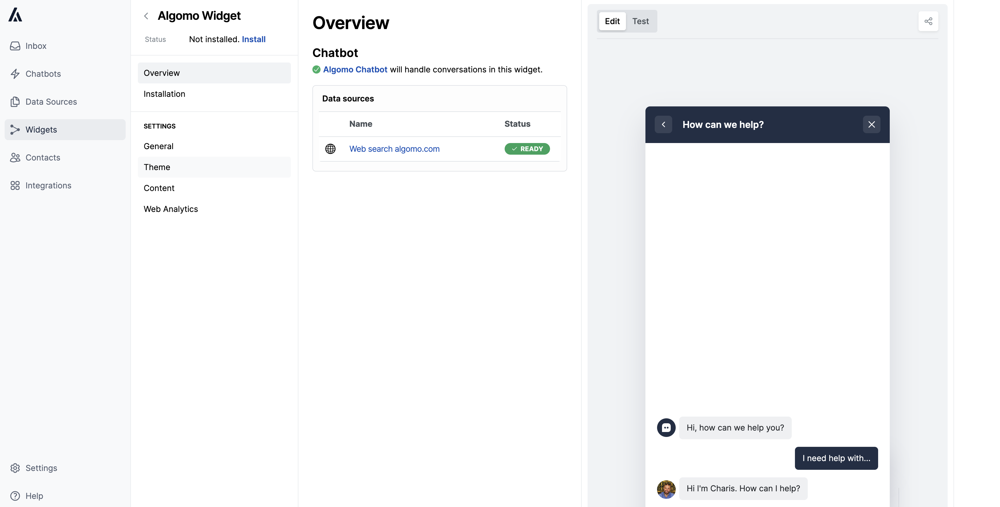

## Overview

### Features & Improvements

1. Visitors will now be able to carry on conversations over email
2. Widget summary page

3. Improve website scraping robustness
4. Fixed random name / colour generator for new visitors occasionally selecting an invalid value

### Coming soon...

1. Authenticated visitors
2. Send visitors emails from your own domain to provide a more seemless experience
3. Allow agents to carry on conversations over email
4. Allow visitors to start conversations over email

---

<h2 id="email">
  Visitors Can Now Pick Up Their Algomo Conversations Via Email
</h2>

Visitors have the capability to continue conversations they initiated via the widget over email. They can now reply straight from their email, and they will receive messages sent from the platform via email as well, ensuring they never miss one.

<h2 id="email">More Enhancements to Email Notifications</h2>

We now make sure that the visitor contact details are up to date when send you email notifications.

  
Bug Fixes

- Improved billing report accuracy
- Fixed bug where changing languages deletes all suggested questions from widgets
- Fixed Stripe bug involving checkouts with a trial
- Fix chatbot not always responding in the correct lanuage
- Better escalation notifications
- Allow the visitor time to fill their details prior to sending the esclation notification

