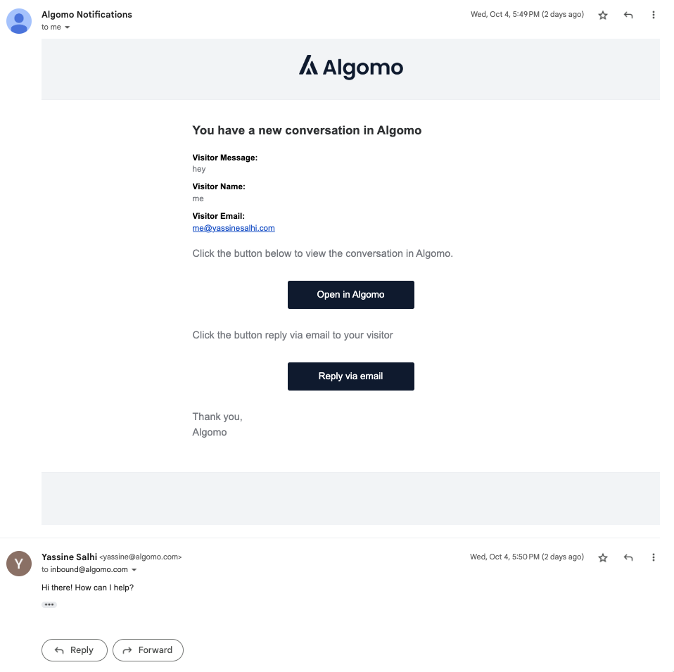
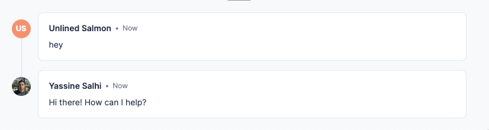
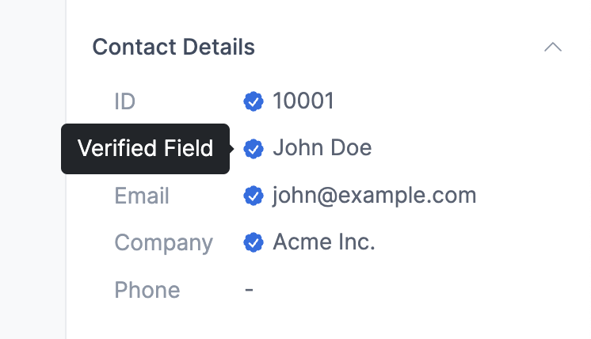
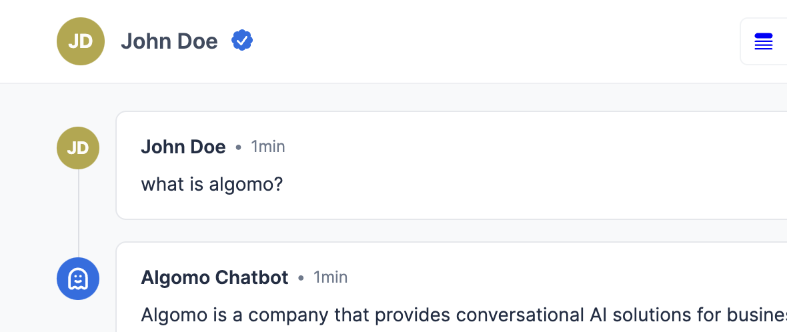
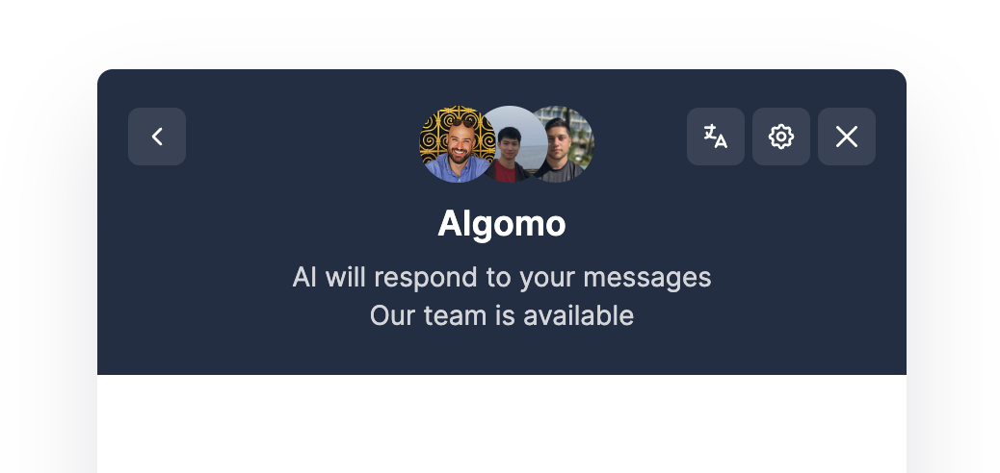
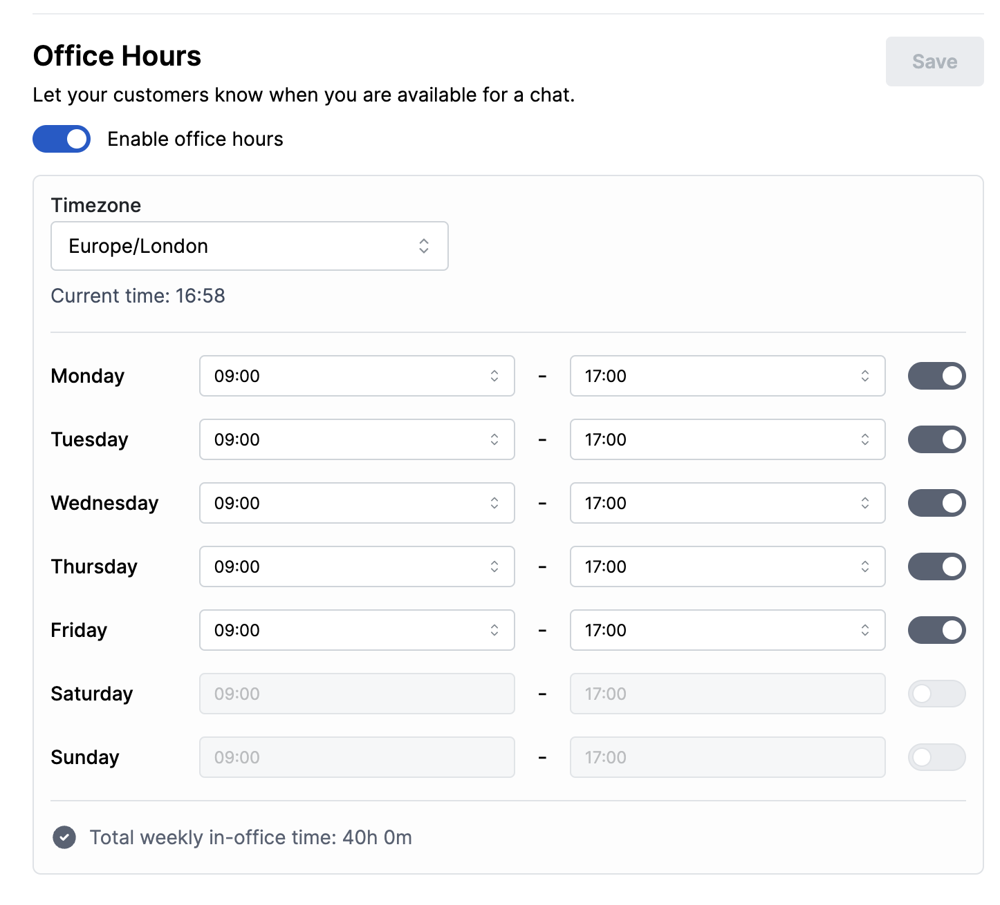

## Overview

1. Email Integration
2. API Access to the Algomo Chatbot AI
3. Authenticated Visitors
4. Organisation Office Hours

## New Features

### **Email Integration: Agent responses & Conversation threads**

 

- Emails related to a single conversation are grouped into one thread, minimizing clutter.
- Real-time updates and messages from Algomo populate in existing email threads without platform switching.
- Users can directly reply to emails; responses integrate into Algomo conversations seamlessly.
- Automated system ensures correct attribution of email replies to conversations and users.
- Instant alerts for mismatched email reply addresses are provided.

### **API Access to Algomo Chatbots**

This enhancement offers an alternative to our standard widget interface, providing you with more control and flexibility for handling complex customer service scenarios.

**Direct API Access**: Seamlessly integrate Algomo's AI into your custom applications or services.

**Context Matters**: The API can refer to previous messages in a conversation thread, making responses more contextually relevant.

If you're looking for a way to customize your AI-driven customer engagement, this feature is for you. If you're a developer aiming to integrate Algomo into your app, direct API access provides the flexibility you need. Learn more about it [here](https://help.algomo.com/docs/api-access/Using%20Our%20Apis)

### Visitor Authentication

In the latest update, we've introduced Visitor Authentication, a feature designed to seamlessly link Algomo visitors with your own user ecosystem. This enhancement serves multiple purposes.

- It allows you to verify visitor identities, significantly reducing the risk of unauthorised impersonations.
- It acts as an extra layer of security to help you mitigate any malicious activities.
- It ensures that a unified conversation history is maintained across multiple devices for each user.
- Once a visitor is authenticated, their data becomes readily accessible within the Algomo interface, streamlining your user management tasks.

### Office Hours

Introducing our new Office Hours feature in the Algomo widget.

1. **Real-Time Availability**: Now, companies can showcase their real-time availability to customers.
2. **Next Accessible Time**: When the team is unavailable, the widget informs customers about the next time they can reach them.
3. **Global Localization**: This feature is localized in all supported languages and is designed to handle various time zones, ensuring a seamless experience for our global customer base.
4. **Transparency and Expectations**: Its primary purpose is to improve transparency and help manage customer expectations when it comes to response times.

 
