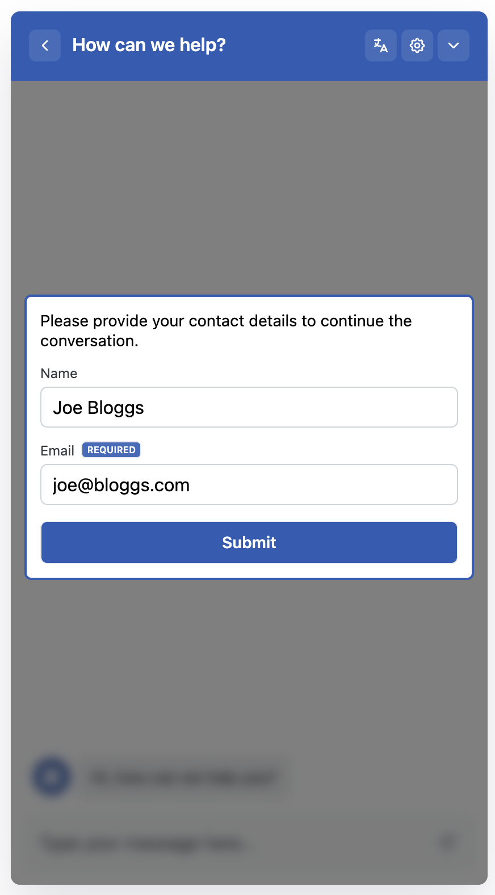
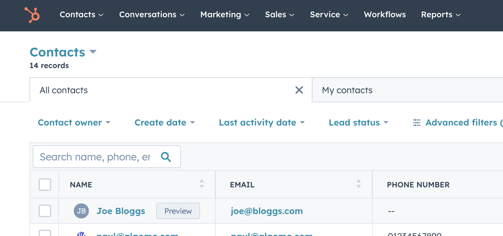

import zapier_video from "./assets/videos/zapier.mov";

## HubSpot CRM Native Integration

Never miss a lead again! Connect Algomo to your HubSpot account and automatically save contact details received during conversations.

Widget lead capture form            |  Lead on hubspot
| ---------------------- | ----------------------  |
  |  

With the HubSpot app, you can easily streamline your team’s workflows and keep your Algomo leads and users synced with HubSpot. You can:

- Automatically send leads/users and their conversations to HubSpot.
- Manually create ‘Contacts’ in HubSpot from Algomo.
- Send Operator-qualified leads to HubSpot automatically.
- Keep your HubSpot contacts updated with their latest Algomo details (name, email, phone and more).
- View your lead’s HubSpot profile beside their conversation in Algomo.
- Check your lead’s conversation history in HubSpot

## Zapier Integration

Zapier lets you connect Algomo with thousands of the most popular apps, so you can automate your work and have more time for what matters most—no code required.

It is very easy to get started!

Just head to `integrations`  and click on the `Zapier` integration

For the time being Algomo can trigger a new Zap for

- New contacts
- New conversations

<video
  width="100%"
  autoplay="true"
  loop="true"
  controls
>

  <source src={zapier_video} />
</video>

