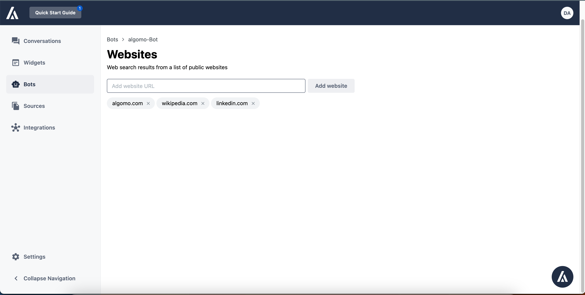

In the website section, you can include all the websites you want your chatbot to pull information from

Contrary to other genAI companies we do not need to store any of the contents of these websites but rather call Websearch in any arbitrary collections of URLs. For example in the below screenshot, we can search for any information within Wikipedia, `algomo` and LinkedIn

