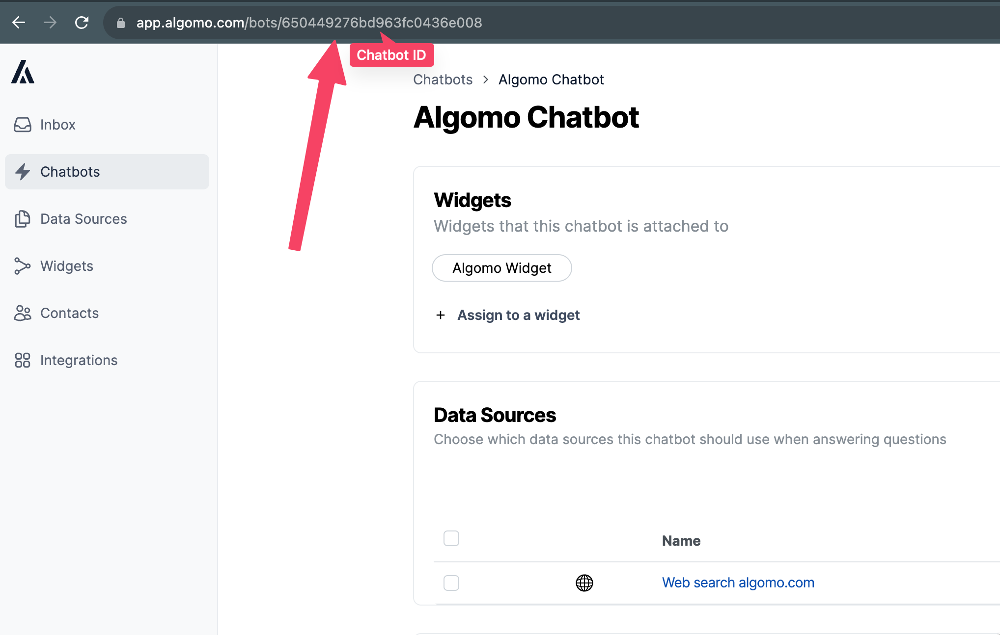

# Generating bot responses

## Introduction

...

## Preliminaries:

Before diving into API calls, please make sure the below is completed:

1. **You have created a chatbot**: Head to [the chatbots page](https://app.algomo.com/bots).
2. **You have added datasources**: Head to [the datasources page](https://app.algomo.com/data-sources)
3. **You have assigned the datasources to your bot**: Head to [the chatbots page](https://app.algomo.com/bots).
3. **You have generated a token**: Head to [the organisation settings](https://app.algomo.com/settings/general).

It is recommended that you test your chatbot responses and add/tweak data sources as needed until your satisfied with the responses.
This can be done by assigning your chatbot to a widget and entering test mode.


## API Endpoint Details
### Things to be aware of
- **Rate limits**: There are rate limits of 5 messages per minute
- **Token validity**: Only one token can be valid at once, generating a new one will invalidate all others.
- **Maximum Message Size**: The message you generate a response for cannot exceed 1000 characters.

### How do I get my chatbot ID?
You can infer the chatbot ID from the URL when browsing a bot by copying it from the URL




### Generating Bot Responses: 
`POST`
`https://app.algomo.com/api/v2/external/api-access/get-bot-response`

#### Request Payload Structure

- **token (string)**: Your authentication token.
- **botId (string)**: Identifier for the chatbot you're querying.
- **customConversationId (string - optional)**: A custom identifier for the conversation, allows the bot to use previous messages for context.
- **messageText (string)**: The text of the message you're seeking a response to.

#### Example Request Payload

##### Structure
```typescript
{
  // Token copied from organisation settings
    "token": "{TOKEN}", 

    // The chatbot you want to use to respond to your message
    "botId": "{CHATBOT_ID}", 

    // your own conversationId to allow responses to take conversational context into account
    "customConversationId": "{MY_OWN_CONVERSATION_ID}", 

    // The message you want the bot to respond to
    "messageText": "{MY_MESSAGE}" 
}
```
##### cURL Request

```cURL
  curl --location --request POST 'http://app.algomo/api/v2/external/api-access/get-bot-response' \
  --header 'Content-Type: application/json' \
  --header 'Accept: application/json' \
  --data-raw '
  {
        "token": "{TOKEN}",
        "botId": "{CHATBOT_ID}",
        "customConversationId": "{MY_OWN_CONVERSATION_ID}",
        "messageText": "{MY_MESSAGE}"
  }
  '
```

#### Response Types

- **200 OK**: Successful request, with a bot-generated response returned.
- **401 Unauthorized**: Access unauthorized due to invalid token.
- **404 Not Found**: Specified bot ID not found.
- **400 Validation Error**: Data validation failure.
- **429 Too Many Requests Error**: Rate limiting.
- **500 Internal Server Error**: Unspecified server error, contact support.


#### Example Successful Response

```typescript
{
  // Generated response
  message: "Algomo is a customer service company.";

  metadata: {
    // The conversationId the response was generated for, if none was provided this will be generated for you
    conversationId: "custom-conversation-id";

    // The queries that were generated based on the message your requested a response to
    generatedQueries: [
      "What is Algomo?",
      "What services does Algomo offer?",
      "What does Algomo do?"
    ];

    // The infromation chunks that were used to inform the bot response
    responseContext: [
      {
        id: "algomo.com/about",
        type: "website",
        text: "We're unlocking access to digital knowledge. Our mission is to democratise access to digital information across every channel, language and geography. Our simple yet powerful platform empowers customers and employees instantly resolve any query, with the least amount of human effort."
      }
    ];
  }
}
```

#### Example Error Response

```typescript
{
  message: "Token is invalid."
}
```

