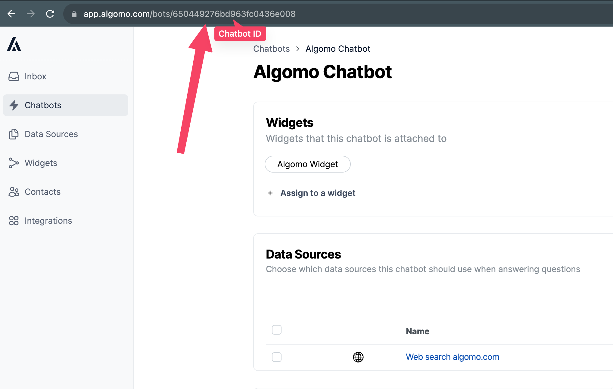

# Generating Responses To Messages

## What is this?

This feature enables you to directly interact with our AI engine, bypassing the traditional widget interface for a more headless approach. By offering this level of access, you can tackle complex use-cases, customizing your AI customer service strategies with greater flexibility and control.

## Prerequisites

Before diving into the API, ensure the following:

1. **Create a Chatbot**: Navigate to [Algomo's chatbots dashboard](https://app.algomo.com/bots).
2. **Add Data Sources**: Visit [the data sources dashboard](https://app.algomo.com/data-sources).
3. **Assign Data Sources**: Link the data sources to your chatbot through [the chatbots dashboard](https://app.algomo.com/bots).
4. **Generate an API Token**: Obtain your API token from [the organization settings page](https://app.algomo.com/settings/general).

Perform preliminary tests on your chatbot and adjust your data sources as needed. Use test mode after linking your chatbot to a widget.

## API Endpoint Specifications

### Considerations

- **Rate Limits**: A limit of 5 messages per minute is enforced.
- **Token Rules**: Only one token can be active at a time.
- **Payload Size Limit**: Messages must not exceed 1000 characters.
- **Behaviour/Tools**: This endpoint will only generate responses to messages. Side effects (such as sending emails or escalating conversations) will not be triggered.

### Identifying Your Chatbot ID

Find the chatbot ID in the URL while browsing your bot's page.



## API Call for Bot Response Generation

**HTTP Method**: `POST`  
**Endpoint**: `https://app.algomo.com/api/v2/external/api-access/get-bot-response`

### Request Payload Schema

- **Authorization Header**: Use the Bearer token for authentication in the Authorization header.
- **botId**: The identifier for the chatbot.
- **messageText**: The message that you wish to generate a response for.
- **conversationId (optional)**: A user-defined identifier for threading conversations.
  - This allows the bot to refer to previous messages when responding, providing more contextually relevant answers. If conversationId isn't provided, one will be generated for you


### Example Request Payload

```typescript
{
  "botId": "{CHATBOT_ID}", 
  "conversationId": "{MY_OWN_CONVERSATION_ID}", 
  "messageText": "{MY_MESSAGE}" 
}

```
##### cURL Request

```
curl --location \ 
--request POST 'https://app.algomo.com/api/v2/external/api-access/get-bot-response' \
--header 'Content-Type: application/json' \
--header 'Accept: application/json' \
--header 'Authorization: Bearer {TOKEN}' \
  --data-raw '
  {
        "botId": "{CHATBOT_ID}",
        "conversationId": "{MY_OWN_CONVERSATION_ID}",
        "messageText": "{MY_MESSAGE}"
  }
  '
```

#### Response Types

- **200 OK**: Successful request, with a bot-generated response returned.
- **400 Validation Error**: Data validation failure.
- **401 Unauthorized**: Access unauthorized due to invalid token.
- **404 Not Found**: Specified bot ID not found.
- **429 Too Many Requests Error**: Rate limiting.
- **500 Internal Server Error**: Unspecified server error, contact support.


#### Example Successful Response

```typescript
{
  // Generated response
  message: "Algomo is a customer service company.";

  metadata: {
    // The conversationId the response was generated for, if none was provided this will be generated for you
    conversationId: "custom-conversation-id";

    // The queries that were generated based on the message your requested a response to
    generatedQueries: [
      "What is Algomo?",
      "What services does Algomo offer?",
      "What does Algomo do?"
    ];

    // The infromation chunks that were used to inform the bot response
    responseContext: [
      {
        id: "algomo.com/about",
        type: "website",
        text: "We're unlocking access to digital knowledge. Our mission is to democratise access to digital information across every channel, language and geography. Our simple yet powerful platform empowers customers and employees instantly resolve any query, with the least amount of human effort."
      }
    ];
  }
}
```

#### Example Error Response

```typescript
{
  message: "Token is invalid."
}
```

