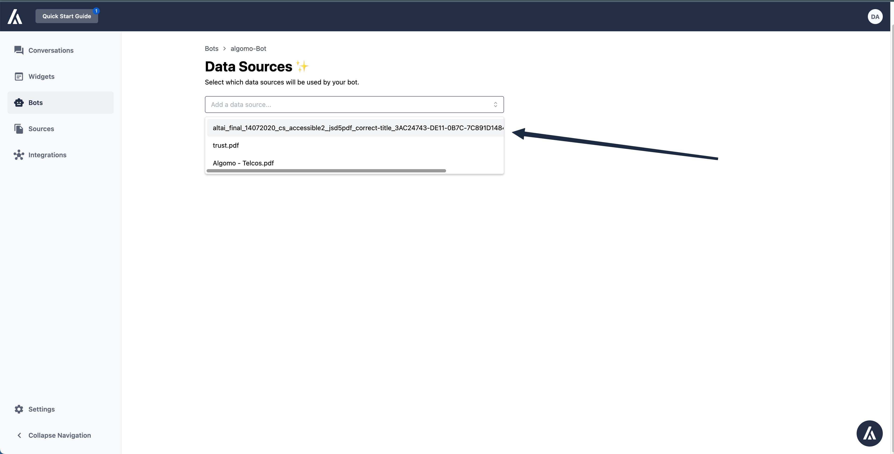

A data source is a collection of an arbitrary amount of documents that contain textual information

If you haven’t, you need to first add some data in the **data sources** menu item.

Once that is done, you can easily select which source you want to add in the dropdown menu here

