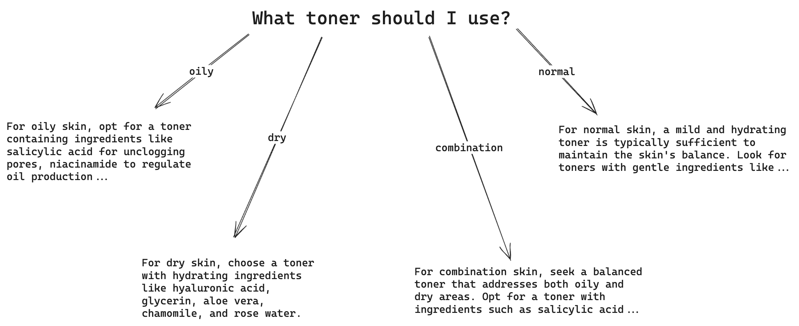
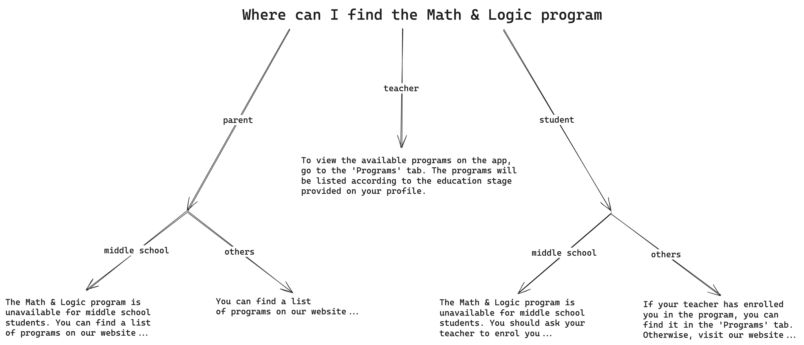

# Tagged Intents (Beta)

Tags are an enhancement designed to provide context-aware responses by associating specific intents with particular tag values, within a variable called a tag name. This feature ensures that responses are tailored to the unique characteristics of the user's query, allowing for a more personalized and accurate interaction. This beta feature is being rolled out to a small number of users. If you believe tagged intents might be useful for your use case, and you would like to gain access, drop us a message via the chat widget on our app, or on the bottom right of the screen.

## Terminology
**Tag Name**: Represents the overarching variable, category or characteristic that influences the chatbot's response.For example, tag names could be "Website Platform", "Mobile OS", "Origin Country", etc.  
**Tag Value**: Denotes a specific value associated with a tag name. For instance, in the context of the examples above, tag values could be "WordPress," "Joomla," "Android" "iOS," "France," "Spain," etc.  
**Tag Description (Optional)**: Provides additional explanation to the chatbot on what the tag name or tag values mean. For example, for `company_size: small / large` it might not be immediately clear how small or large is defined. Adding "Companies with less than 50 employees are considered small" would help the chatbot select the right values more consistently.

## How it Works
1. **Intent Tagging:**
    Each intent in the chatbot's knowledge base is tagged with one or more tag names and their corresponding tag values. These tags indicate the specific context in which the intent should be triggered.
    ```
    Intent: How do I install WordPress?
    Tags: Website Platform - WordPress
    Response: To install WordPress, follow these steps...
    ```
2. **User Query Analysis:**
    When a user submits a query, the chatbot analyzes the input to identify relevant tag values based on the user's characteristics or preferences. If the chatbot is unsure of the specific tag value that applies for the query, the chatbot will ask the user clarifying questions.
    ```
    User: How do I install a CMS?
    --- Tags identified: Website Platform - Unknown ---
    Chatbot: Do you use Wordpress or Joomla?
    ```

3. **Context-Dependent Responses:**
    The chatbot selects the appropriate intent based on the identified tags, ensuring that the response is contextually relevant to the user's specific needs. The chatbot writes the response drawing from the information provided within matched tagged intents, so the intent may not be used verbatim.
    ```
    Selected Intent: How do I install WordPress?
    Response: To install WordPress, follow these steps...
    ```


## Examples

Here are a few examples of when tagged intents would help.

### Freelance Platform
Upwork is a leading online freelancing platform connecting clients with freelancers across various fields. Clients post projects, and freelancers bid on them, creating a dynamic marketplace. 

Since Upwork has both clients and freelancers using their platform, they frequently have questions from both types of users. This means there are some questions that both freelancers and clients might ask, where the answer for freelancers would not be the same as the answer for clients.

**Example Intents**  
```
Intent: How do I leave feedback for a freelancer?
Tags: Role - Client
Response: To leave feedback for a freelancer on Upwork as a client, follow these steps:
1. Go to Jobs > All contracts.
...
```

```
Intent: How do I leave feedback for a client?
Tags: Role - Freelancer
Response: To leave feedback for a client on Upwork, go to My Jobs. Go to the Ended Contracts section and find the contract you wish to leave feedback on...
```

Both trigger on similar questions, and both answers are a valid response to the question 'How do I leave feedback'.

**Example Conversations**  
This is what a conversation with the chatbot might look like if the intents are not tagged.
```
User: How do I leave feedback?
Chatbot: To leave feedback for a freelancer, ... To leave feedback for a client, ...
```
Since it is ambiguous whether the user wants to leave feedback for a freelancer or a client, the chatbot might attempt to provide the answer for both. This results in a very lengthy response, where half of the answer is useless to the user.

With tags, the conversation might go more like this.
```
User: How do I leave feedback?
Chatbot: In order to provide an accurate answer, could you tell me if you are a freelancer, or a client?
User: I am a client.
Chatbot: To leave feedback for a freelancer, ...
```
By asking the user for clarifying information, the chatbot narrows down the potential answer to just a single intent. This is a much more streamlined way to provide information to your users. On top of that, the conversation feels much more natural too!


### Skincare
Kiehl's is an American cosmetics brand that specializes in skin, hair, and body care products. A common question that customers of Kiehl's might ask is "What kind of face products should I use?". When asking a real Kiehl's store assistant, they always respond by asking "What skin type do you have?". This is because the answer to this question highly depends on the customer's skin type, since different ingredients in facial products work best with different skin type. 

Here is an image that illustrates the branching structure for ideal answers towards the question "What toner should I use?". 



By representing the answers as intents, and tagging them with the appropriate tags (eg. `skin_type:oily`), the chatbot can traverse the branches during the conversation and pick out the right answer to provide. This represents a much nicer experience for the user. Instead of reading a huge block of text to get their information, users can interact with the chatbot conversationally, and recieve only useful information.


### Education Platform
This example demonstrates when having multiple tags would be beneficial. In this example, we have a eLearning platform as assistance for teachers in augmenting their students' education. This platform needs to cater to teachers, students and parents, who use different apps to access different functionality within the platform. 

**Tag 1: Role**  
Here is an example question involving the first tag: `Role`. It can take the values `Student`, `Teacher` or `Parent`.
```
Intent: How do I sign in?
Tags: Role - Student
Response: To sign in into the student portal, start by installing ...
```

```
Intent: How do I sign in?
Tags: Role - Teacher
Response: To sign in into your account, go to ...
```

```
Intent: How do I sign in?
Tags: Role - Parent
Response: To view your child's progress, you need an invite from ...
```

**Tag 2: Education Stage**  
The second tag used could be education stage (middle school, high school, college). This dictates the type of educational content and programs available for students.

```
Intent: What does the algebra program cover?
Tags: Education Stage - High School
Response: The algebra syllabus covers multiplication, division, ...
```

```
Intent: What does the algebra program cover?
Tags: Education Stage - College
Response: The algebra syllabus includes solving systems of equations in matrices, ...
```

**Combination**  
A subset of questions would use both tags at once, leading to a two tiered branching structure shown below. 



Here are some example intents demonstrating how the branching structure of the answers to the question 'Where can I find the Math & Logic Program' is captured in tagged intents. The first intent below shows the Teacher branch. Note that since this answer does not depend on the education stage (the teacher's list of programs is automatically adjusted), the intent shown below does not contain the Education Stage tag.

```
Intent: Where can I find the Math & Logic Program?
Tags: Role - Teacher
Response: To view the available programs on the app...
```

These next two intents represent the parent branches. The first intent applies to only parents with middle school children, so it has both the `Role:Parent` tag and the `Education Stage: Midde School` tag. The second intent applies to parents with children of education levels other than middle school, so it has the `Role:Parent` tag and no Education Stage tag. 

```
Intent: Where can I find the Math & Logic Program?
Tags: Role - Parent, Education Level - Middle School
Response: The Math & Logic program is unavailable for middle school students. You can find a list of ...
```

```
Intent: Where can I find the Math & Logic Program?
Tags: Role - Parent
Response: You can find a list of programs...
```

Similarly, the student branches are shown below.

```
Intent: Where can I find the Math & Logic Program?
Tags: Role - Student, Education Level - Middle School
Response: The Math & Logic program is unavailable for middle school students. You should ask your teacher ...
```

```
Intent: Where can I find the Math & Logic Program?
Tags: Role - Student
Response: If your teacher has enrolled you in the program, you can find it in the 'Programs' tab ...
```

**Example Conversation**

Using the intents in the combination section above, here is how a user conversation with the chatbot might look like.

```
User: How do I sign in?
Chatbot: Before answering your question, can you tell me if you are a student, teacher or parent?
User: parent
Chatbot: To view your child's progress, you need an invite from your child's teacher. Once sent, you should recieve an email containing a class code, which should be entered at https://learningplatform.edu/classroom/parent
User: Thanks. Where can I find the Math & Logic program?
Chatbot: Which education level is your child in? Is it middle school, high school or college?
User: middle school
Chatbot: Unfortunately, the Math & Logic program is unavailable for middle school students. You can find a list of available programs for every education level on our website, at https://learningplatform.edu/programs
```

Here is another example conversation, this time with the chatbot asking for both tags at once. Users can provide the answers in any order, and even provide the right contextual information without explicitly stating the tag value. This is in contrast with the strict step-by-step branching behaviour from rule-based chatbots.
```
User: Where can I find the Math & Logic program?
Chatbot: To give you an accurate answer, I need to ask you a few questions. Are you a student, teacher or parent? Which education level is your child in (middle school, high school, college)
User: middle school
Chatbot: Thank you for providing the education level. Are you a student, teacher or parent?
User: My daughter is enrolled in one of your programs.
Chatbot: Unfortunately, the Math & Logic program is unavailable for middle school students. You can find a list of available programs for every education level on our website, at https://learningplatform.edu/programs
```

This shows how you can capture more complicated branching structures using tags. For more guidance on how to model your use case using tagged intents beyond what was shown in the examples below, get in contact with us using the chat widget on the bottom right of this page.


### Other Brief Examples
1. Software - operating_system: Windows / MacOS / Linux
2. Travel Agency (operating in South East Asia) - country: Thailand / Vietnam /Cambodia / Laos / Indonesia
3. Ecommerce platform - user_type: 
3. Pet Adoption Agency - user_role: Adopter / Rehomer
4. Fitness App (with different apps for coaches and clients) - role: Coach / Client

## Limitations
1. The tag values needs to be multiple choice, and limited to less than 20 options. This means having `email` or `phone number` as a tag would not work.
    - one workaround for tags with many options (like `country`) is to group them together (eg. `Europe` or `France & Spain`) if answers within a group are similar.
2. For tags to work well, the choice of tag and tag-values affect the quality of the chatbot's conversations. Some experimentation is required to get the most out of tagged intents.

## Summary
The goal of tagged intents is to capture the branching structure of real-life interactive conversations, while stepping away from the strict behaviour of rule-based chatbots. Current state-of-the-art chatbots still tend to only excel at Question-Answering style conversations, where a single question is followed by a single answer. Our beta feature attempts to address this robotic conversation style, while giving you control of what information the chatbot should gather.

Tags are most useful in scenarios where the answer to a question can be modelled in a branch structure, similar to the Kiehl's example above. If your customer service agents frequently need to ask specific questions with multiple choice styled responses before answering, this might be a feature that you could benefit from. To try out our beta feature, message us via the chat widget on our app, or on the bottom right of the screen.