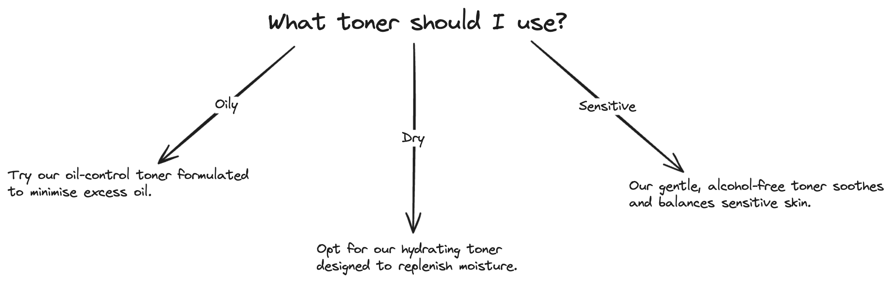
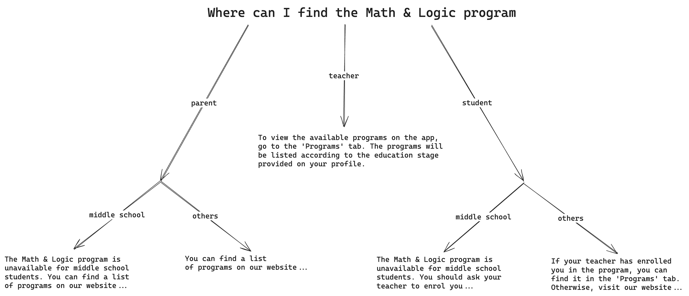

# Tagged Intents (Beta): Context-Aware Responses

## Skincare Example
Kiehl's, an American cosmetics brand, offers various skincare products catering to different skin types. When customers inquire about face products, their needs depend heavily on their skin type. For instance, individuals with oily skin require different products compared to those with dry or sensitive skin.



### Tagged Intents for Skincare
You will need to create one intent per tagged response. Here are the intents corresponding to the Kiehls example:

- **Intent:** What toner should I use?
    - **Tags:** Skin Type - Oily
    - **Response:** Try our oil-control toner formulated to minimize excess oil.
- **Intent:** What toner should I use?
    - **Tags:** Skin Type - Dry
    - **Response:** Opt for our hydrating toner designed to replenish moisture.
- **Intent:** What toner should I use?
    - **Tags:** Skin Type - Sensitive
    - **Response:** Our gentle, alcohol-free toner soothes and balances sensitive skin.

## Tagged Intents Overview
Tags enhance the chatbot's ability to provide context-aware responses, ensuring tailored interactions. Here's how it works:

1. **Intent Tagging:**
   - Each intent in the chatbot's knowledge base is tagged with relevant characteristics such as skin type for skincare inquiries.
     ```
     Intent: What toner should I use?
     Tags: Skin Type - Oily
     Response: Try our oil-control toner formulated to minimize excess oil.
     ```

2. **User Query Analysis:**
   - The chatbot analyzes user queries to identify relevant tag values, like skin type, to provide personalized responses. If the chatbot is unsure of the specific tag value that applies for the query, the chatbot will ask the user clarifying questions.
     ```
     User: What toner should I use?
     --- Tags identified: Skin Type - ??? ---
     Chatbot: What skin type do you have?
     ```

3. **Context-Dependent Responses:**
   - Based on the identified tags, the chatbot selects the appropriate intent, ensuring contextually relevant responses.
     ```
     User: What toner should I use for oily skin?
     --- Tags identified: Skin Type - Oily ---
     --- Matched Intent: "What toner should I use?" ---
     Response: For oily skin, we recommend...
     ```

This feature is currently in beta and is gradually rolling out. If you're interested in gaining access, please reach out to us via the chat widget on our app or at the bottom right of the screen.

## Other Examples

Here are two other examples of tagged intents in action.

### Freelance Platform
Upwork, an online freelancing platform, serves both clients and freelancers. Tagged intents differentiate responses based on the user's role.

#### Intents
- **Intent:** How do I leave feedback?
    - **Tags:** Role - Client
    - **Response:** To leave feedback for a freelancer, navigate to the job the freelancer was hired for, and click on 'Give Feedback'.
- **Intent:** How do I leave feedback for a client?
    - **Tags:** Role - Freelancer
    - **Response:** To leave feedback for a client, fill out the feedback form on their profile.

#### Example Conversations
**Without tagged intents**  
This is what a conversation with the chatbot might look like if the intents are not tagged.
```
User: How do I leave feedback?
Chatbot: To leave feedback for a client, navigate to the job the freelancer was hired for, and click on 'Give Feedback'. To leave feedback for a freelancer, fill out the feedback form on their profile.
```
Since it is ambiguous whether the user wants to leave feedback for a freelancer or a client, the chatbot might attempt to provide the answer for both. This results in a very lengthy response, where half of the answer is useless to the user.

**With tagged intents**  
With tags, the conversation might go more like this.
```
User: How do I leave feedback?
Chatbot: In order to provide an accurate answer, could you tell me if you are a freelancer, or a client?
User: I am a client.
Chatbot: To leave feedback for a freelancer, navigate to the job the freelancer was hired for, and click on 'Give Feedback'.
```
By asking the user for clarifying information, the chatbot narrows down the potential answer to just a single intent. This is a much more streamlined way to provide information to your users. On top of that, the conversation feels much more natural too!


### Education Platform (Multiple tags)
An eLearning platform caters to teachers, students, and parents, with varying access and functionalities. Tagged intents consider both roles and education stages.

#### Tag 1: Role
Here is an example question involving the first tag: `Role`. It can take the values `Student`, `Teacher` or `Parent`.
- **Intent:** How do I sign in?
    - **Tags:** Role - Student
    - **Response:** To sign in, visit the student portal at https://portal.learn.edu/sign-in and enter your classroom ID, email, and password.
- **Intent:** How do I sign in?
    - **Tags:** Role - Teacher
    - **Response:** To sign in to your account, go to https://app.learn.edu/sign-in and enter your email and password.
- **Intent:** How do I sign in?
    - **Tags:** Role - Parent
    - **Response:** To view your child's progress, you need an invite from the classroom teacher. The link to visit the student progress page will be included within the invitation email.

#### Tag 2: Education Stage
The second tag used is education stage (`middle school`, `high school` or `college`). This dictates the type of educational content and programs available for students.

- **Intent:** What does the algebra program cover?
  - **Tags:** Education Stage - High School
  - **Response:** The algebra syllabus covers linear equations, quadratic equations, and inequalities.

- **Intent:** What does the algebra program cover?
  - **Tags:** Education Stage - College
  - **Response:** The algebra syllabus includes solving systems of equations in matrices, vector spaces, and complex numbers.

#### Combination of Tags
A subset of questions would use both tags at once, leading to a two tiered branching structure. Let us consider the example question: "Where can I find the Math & Logic Program?"



Let us go look at the branches one at a time.

##### Tag: Role - Teacher
For this example, we assume that the answer does not depend on the education stage. Therefore, the intent for the teacher branch does not have the `Education Stage` tag.
- **Intent:** Where can I find the Math & Logic Program?
    - **Tags:** Role - Teacher
    - **Response:** To view the available programs on the app, go to https://app.learn.edu/programs. Programs across all education levels will be listed here. You can search and filter by education level or topic to find the best programs for your students.

##### Tag: Role - Parent
These next two intents represent the parent branches. The first intent applies to only parents with middle school children, so it has both the `Role:Parent` tag and the `Education Stage: Midde School` tag. 

- **Intent:** Where can I find the Math & Logic Program?
    - **Tags:** Role - Parent, Education Level - Middle School
    - **Response:** The Math & Logic program is unavailable for middle school students. You can find a list of available programs for every education level on our website, at https://learn.edu/programs

The second intent applies to parents with children of education levels other than middle school, so it has the `Role:Parent` tag and no Education Stage tag. 

- **Intent:** Where can I find the Math & Logic Program?
    - **Tags:** Role - Parent
    - **Response:** You can find the list of mathematics programs at https://www.learn.edu/programs/?topic=math.

##### Tag: Role - Student
Similarly, the student branches are shown below.

- **Intent:** Where can I find the Math & Logic Program?
    - **Tags:** Role - Student, Education Level - Middle School
    - **Response:** The Math & Logic program is unavailable for middle school students.
- **Intent:** Where can I find the Math & Logic Program?
    - **Tags:** Role - Student
    - **Response:** If your teacher has enrolled you in the program, you can find it in the 'Programs' tab on your eLearning portal at https://portal.learn.edu/account/programs

#### Example Conversations

**Example 1**  
Using the intents in the combination section above, here is how a user conversation with the chatbot might look like.

```
User: How do I sign in?
Chatbot: Before answering your question, can you tell me if you are a student, teacher or parent?
User: parent
Chatbot: To view your child's progress, you need an invite from your child's teacher. The link to visit the student progress page will be included within the invitation email.
User: Thanks. Where can I find the Math & Logic program?
Chatbot: Which education level is your child in? Is it middle school, high school or college?
User: middle school
Chatbot: Unfortunately, the Math & Logic program is unavailable for middle school students. You can find a list of available programs for every education level on our website, at https://www.learn.edu/programs
```

**Example 2**  
Here is another example conversation, this time with the chatbot asking for both tags at once. Users can provide the answers in any order, and even provide the right contextual information without explicitly stating the tag value. This is in contrast with the strict step-by-step branching behaviour from rule-based chatbots.
```
User: Where can I find the Math & Logic program?
Chatbot: To give you an accurate answer, I need to ask you a few questions. Are you a student, teacher or parent? Which education level is your child in (middle school, high school, college)
User: middle school
Chatbot: Thank you for providing the education level. Are you a student, teacher or parent?
User: My daughter is enrolled in one of your programs.
Chatbot: Unfortunately, the Math & Logic program is unavailable for middle school students. You can find a list of available programs for every education level on our website, at https://learn.edu/programs
```

This shows how you can capture more complicated branching structures using tags. For more guidance on how to model your use case using tagged intents beyond what was shown in the examples, get in contact with us using the chat widget on the bottom right of this page.


### Other Brief Examples
1. Software - operating_system: Windows / MacOS / Linux
2. Travel Agency (operating in South East Asia) - country: Thailand / Vietnam /Cambodia / Laos / Indonesia
3. Ecommerce platform - user_type: 
3. Pet Adoption Agency - user_role: Adopter / Rehomer
4. Fitness App (with different apps for coaches and clients) - role: Coach / Client

## Limitations
1. The tag values needs to be multiple choice, and limited to less than 20 options.
    - This means collecting `email` or `phone number` as a tag would not work. This is because valid input emails or phone numbers cannot be defined up front for a multiple choice format.
    - However, one workaround for tags with many options (like `country`) is to group them together (eg. `Europe` or `France & Spain`) if answers within a group are similar.
2. For tags to work well, the choice of tag and tag-values affect the quality of the chatbot's conversations. Some experimentation is required to get the most out of tagged intents.

## Summary
The goal of tagged intents is to capture the branching structure of real-life interactive conversations, while stepping away from the strict behaviour of rule-based chatbots. Current state-of-the-art chatbots still tend to only excel at Question-Answering style conversations, where a single question is followed by a single answer. Our beta feature attempts to address this robotic conversation style, while giving you control of what information the chatbot should gather.

Tags are most useful in scenarios where the answer to a question can be modelled in a branch structure, similar to the Kiehl's example above. If your customer service agents frequently need to ask specific questions with multiple choice styled responses before answering, this might be a feature that you could benefit from. To try out our beta feature, message us via the chat widget on our app, or on the bottom right of this page screen.