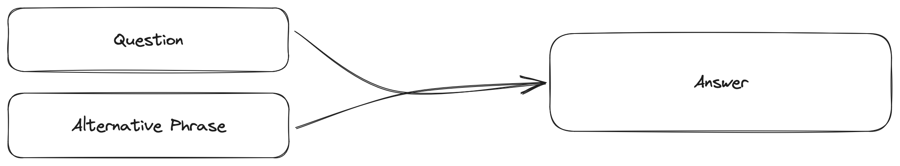

## Introduction to Data Sources

In this section, we'll explore the concept of data sources within ALGOMO. Data sources play a crucial role in providing information for bots to answer questions. Think of them as the building blocks of knowledge that make up your bot. These sources can take various forms, such as PDF documents, structured Question and Answers (intents), website searches (via Bing or index versions), and more.

Understanding how data sources work is fundamental to configuring your bot effectively. In the following sections, we will delve into the different types of data sources and how they are integrated into the system's workflow.

## Types of Data Sources

There are three primary types of data sources within the system:

- **Intents**
- **Websites**
- **Documents**

Each of these data source types follows a distinct lifecycle and serves a unique purpose in the system. Let's explore each of them in greater detail.

## Intents: Training Your Bot

Intents are question and answer pairs that are used to train your bot. They are a simple and effective way to teach your bot how to answer questions. Users can create intents, and these can be assigned to specific bots. A bot can be associated with multiple intents, allowing for versatile conversational abilities.

### Understanding Intent Creation

Intents are crafted within Algomo by navigating to [**Algomo**](https://app.algomo.com/) > [**Data Sources**](https:app.algomo.com/data-sources) > [Create](https://app.algomo.com/data-sources/create/intent-group). Here you can create a new intent group and add intents to it.

Intents are comprised of two primary components: Questions and Answers

**Questions** are the queries that users will ask your bot. They can be phrased in a variety of ways, and the system will attempt to match them to the appropriate intent. For example, if you were creating an intent for a bot that answers questions about algorithms, you might include questions such as:

- What is an algorithm?
- What is a sorting algorithm?
- What is a binary search algorithm?

**Answers** are the responses that your bot will provide when a user asks a question. They can be simple text responses or more complex, such as a link to a website or a PDF document. For example, if you were creating an intent for a bot that answers questions about the weather, you might include answers such as:

- An algorithm is a set of instructions for solving a problem or performing a task.
- A sorting algorithm is an algorithm that puts elements of a list in a certain order.
- A binary search algorithm is an algorithm that finds the position of a target value within a sorted array.

Adding these intents to your bot will allow it to answer questions about algorithms. You can also add more complex answers, such as links to websites or PDF documents.

## Websites: Providing Context

Websites serve as another valuable data source category. They enrich your bot's responses by connecting to available online information. If your website contains relevant content, you can utilise it to enhance your bot's answers. With Algomo, you have the capability to gather data from websites that can be searched using Bing, and then scrape this data. This collected information can be used to address inquiries and provide direct links to it.

Algomo has the capacity to extract data from hundreds of pages on a website, ensuring you have access to the information you require.

Additionally, Algomo provides the option to prevent specific webpages from being scraped. This feature is particularly useful when you have webpages containing sensitive information or when you prefer not to include certain pages in the indexing process.

This data source is versatile and allows you to re-scrape the website whenever necessary to keep your data up to date.

## Documents: More Than Just PDFs

Documents are another valuable data source category. They allow you to upload files which can be used to answer questions or provide additional context for your bot's responses.
Algomo currently supports the following document types:

- PDF
- Text
- Markdown

These can be uploaded directly to the system and then used to answer questions or provide additional context for your bot's responses.
