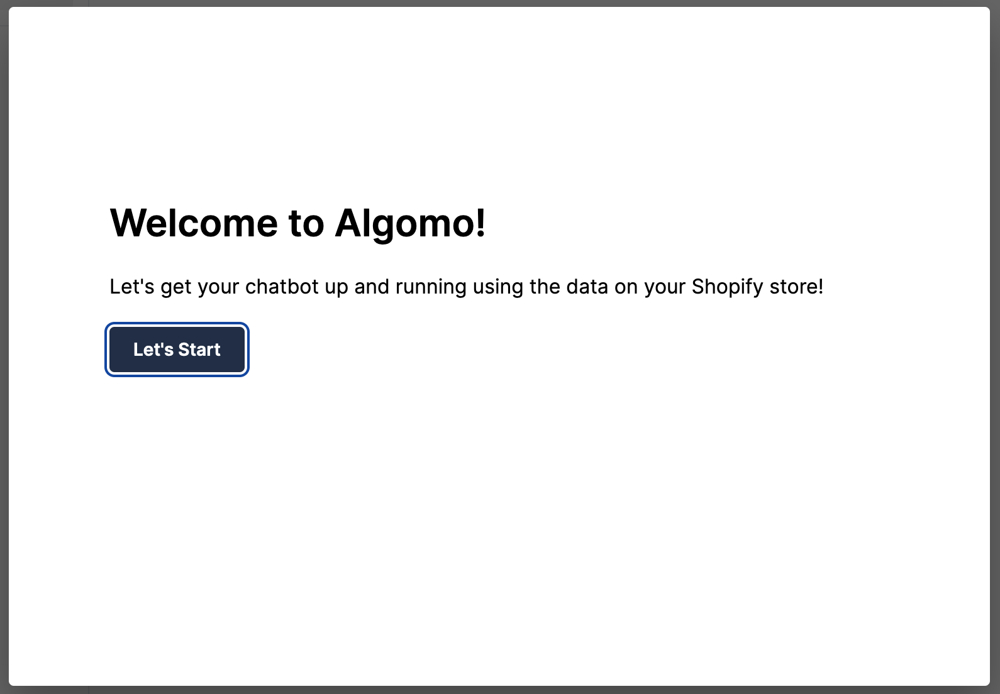
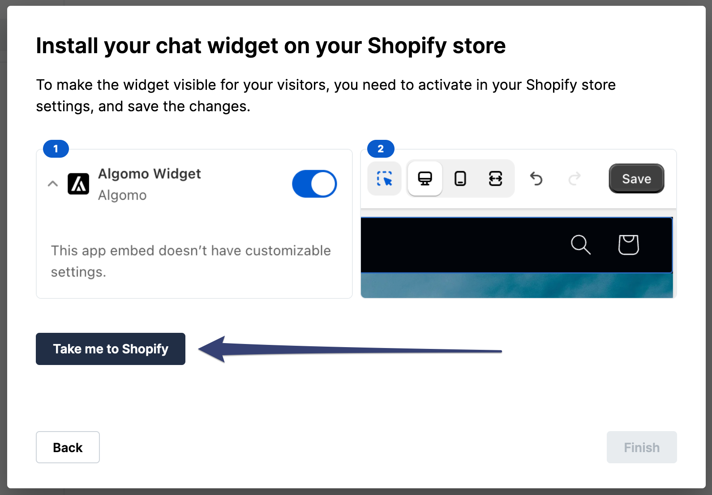

Let's get you setup with Shopify!

### Create a Shopify Account

Ensure you have a Shopify account. If you don't already, you can create one [here](https://www.shopify.com/).

### If you’re a new Algomo customer

1. Navigate to [Algomo](https://app.algomo.com/) > [Sign Up](https://app.algomo.com/signup).
2. Sign up with your email address and password.
3. You will be sent a verification email. Click on the link in the email to verify your account.
4. Once you’re done, you will be redirected to Algomo and have to complete the onboarding process.
   
5. Continue through the onboarding process until you reach the **"Installation"** step.
   
6. Press the **"Take me to Shopify"** button to connect your store to Algomo.
7. We will take it from there and enable the Algomo widget on your store.
   

### Congratulations!

Congratulations! You've just connected your store to Algomo and installed the widget. Now you can start using Algomo to increase your sales.
