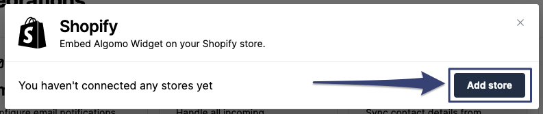
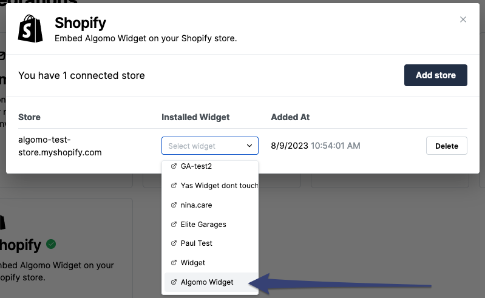

Let's get you setup with Shopify!

### Create a Shopify Account

Ensure you have a Shopify account. If you don't already, you can create one [here](https://www.shopify.com/).

### Connect your store to Algomo

1. Sign in to your account.
2. Navigate to [Algomo](https://app.algomo.com/) > [Integrations](https://app.algomo.com/integrations) > [Shopify](https://app.algomo.com/integrations/shopify).
3. Once you’re on the Shopify integration page, click on the **"Add store"** button.
   
4. You will be redirected to shopify. Make sure you are logged in to your shopify account.
5. Finish the shopify steps to install Algomo to your store.
6. Once you’re done, you will be redirected back to Algomo. You should see your store listed in the **"Shopify Integration"** section.
7. Select the widget you want to install.
   

### Install widget to your store

Congratulations! You've just connected your store to Algomo. Now you can install widgets to your store.
