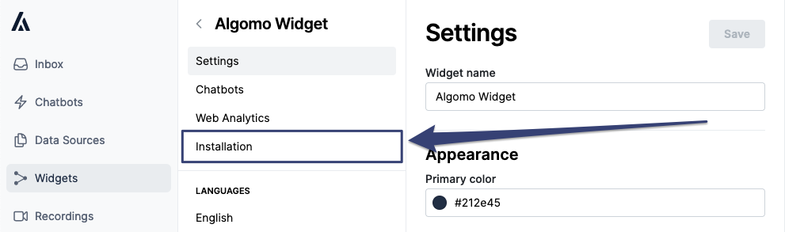
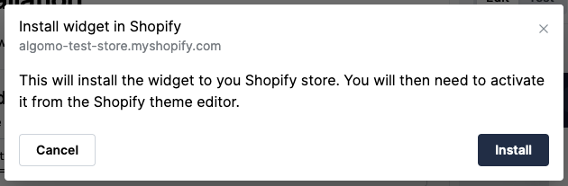
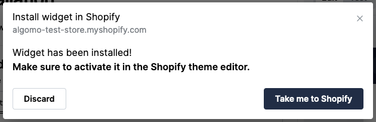
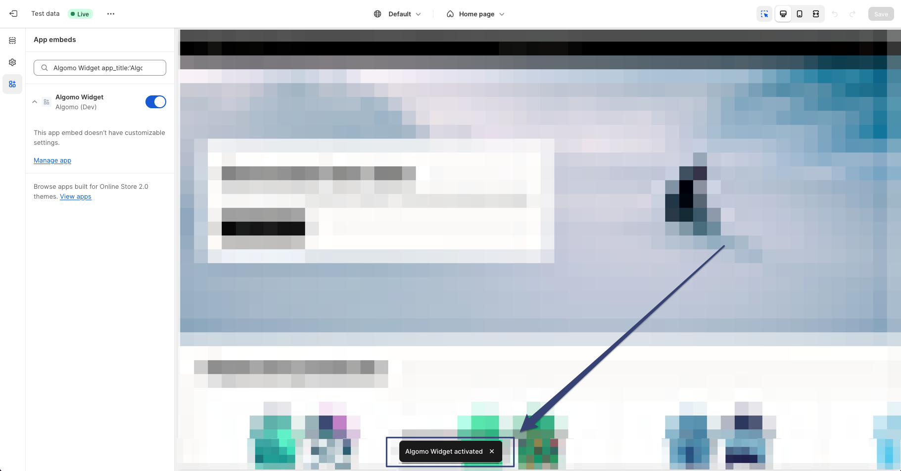
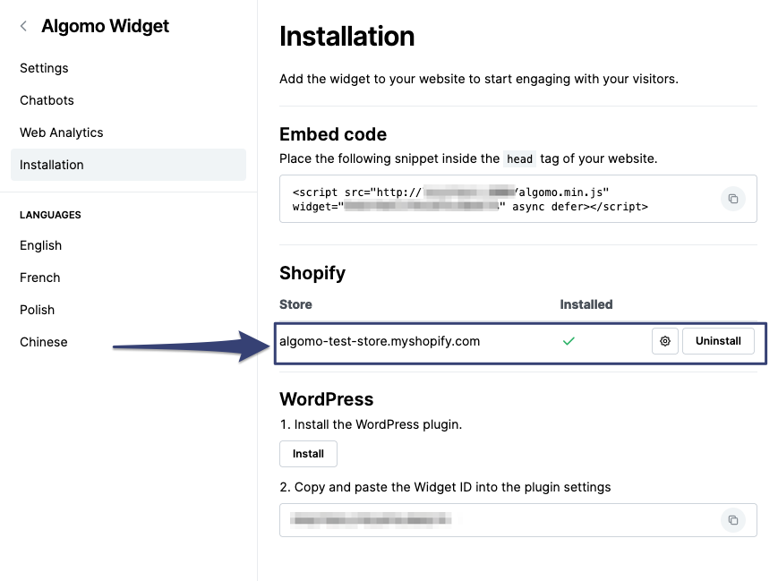

You can install a widget to your Shopify store in the widget installation settings.

### Install widget to your store

1. Got to the [widgets](https://app.algomo.com/widgets) page.
2. Select the widget you want to install.
3. Navigate to the **"Installation"** tab of your widget.
   

4. If you have a Shopify store connected to Algomo, you will see a **"Shopify"** pop-up.
   
5. Press the install button and viola! Your widget is now installed to your store.
   

You will need to add the widget to your store theme to see it in action. You can do this by navigating to the **"Theme"** tab and pressing the **"Add to theme"** button. Or simply press the **"Take me to Shopify"** button and we will handle it for you.

### Remove widget from your store

- You can remove a widget from your Shopify store in the widget installation settings. You can also quickly jump to installation settings for a widget and press uninstall.
  
