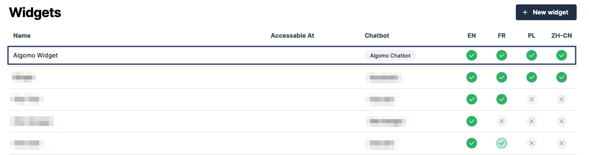

You can install a widget to your Shopify store in the widget installation settings.

1. Got to the [widgets](https://app.algomo.com/widgets) page.
2. Select the widget you want to install.
   
3. Navigate to the **"Installation"** tab.
   
4. Your Shopify store will be listed in the **"Install to"** section. Click on the **"Install"** button to install the widget to your store.

You can see which widgets are installed in your stores in the Shopify settings.

You can also quickly jump to installation settings for a widget.
