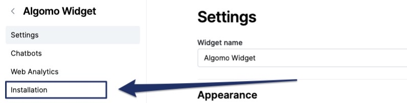

You can install a widget to your Shopify store in the widget installation settings.

### Install widget to your store

1. Got to the [Widgets](https://app.algomo.com/widgets) page.
2. Select the widget you want to install.
3. Navigate to the **"Installation"** tab of your widget.
   
4. If you have a Shopify store connected to Algomo, you will see a **"Shopify"** pop-up.
   
5. Press the **Install** button and voila! Your widget is now installed to your store.
   
6. Press the **"Take me to Shopify"** button and we will handle the rest for you.
   
