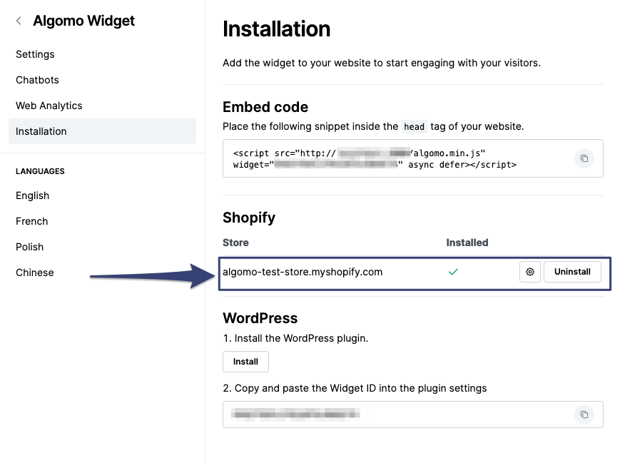
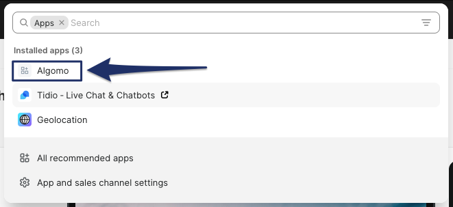

### Remove widget from your store

- You can remove a widget from your Shopify store in the widget installation settings. You can also quickly jump to installation settings for a widget and press uninstall.
  

### Installation unsuccessful/incomplete

If you installed Algomo to your Shopify store, but haven’t finished the installation on Algomo side:

1. Go to you Shopify admin, click on **Apps**.

2. A pop-up will appear, click on **Algomo** and resume the installation.
   
