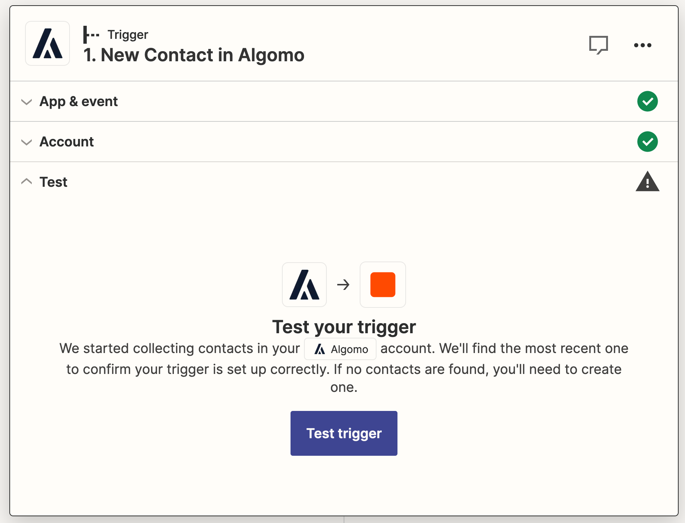
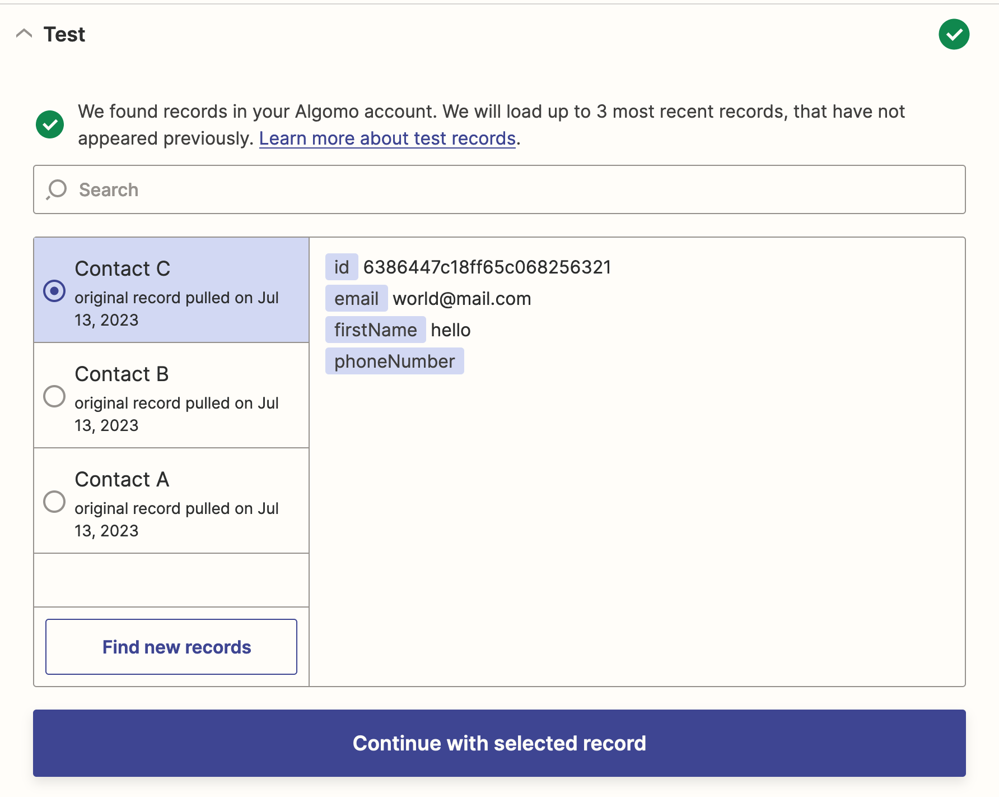
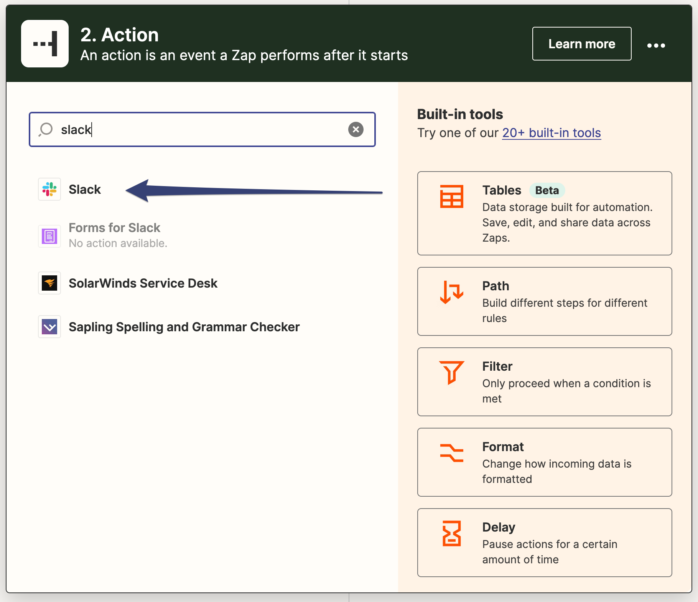

Now that Zapier connected to Algomo, you can start building Zaps to automate tasks and connect Algomo with other applications.

### Step 1: Test Your Trigger

Click on the **"Test Trigger"** button to test your trigger. This will fetch the latest data from your Algomo account and display it in the Zapier window.
Once you're satisfied with the data, click on the **"Continue to selected record"** button to proceed.

### Step 2: Choose an Action App

In the **"Choose an Action App"** search box, type the application you wish to use as an action and select it from the search results. (For example, **"Slack"**)

### Step 3: Choose an Action Event

In the **"Choose Action Event"** search box, type the event you wish to use as an action and select it from the search results. (For example, **"Send Channel Message"**)

### Step 4: Connect Your Action Account

Click on the **"Sign in"** button to connect your action account to Zapier.

### Step 5: Customise Your Action

Customize your action by filling in the required fields. (For example, **"Channel"** and **"Message Text"**)

### Step 6: Test Your Action

Click on the **"Test"** button to test your action. This will send a message to the channel you specified in the previous step. Review the message and change it if necessary. Then click on the **"Restest action"** until you're happy. Then press the **"Publish"** button to finish.

Congratulations, you've just created your first Zap! Now you can create more Zaps to automate tasks and connect Algomo with other applications.
