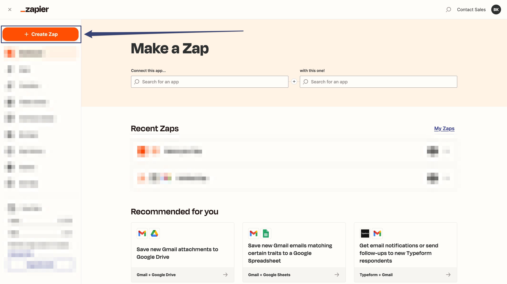
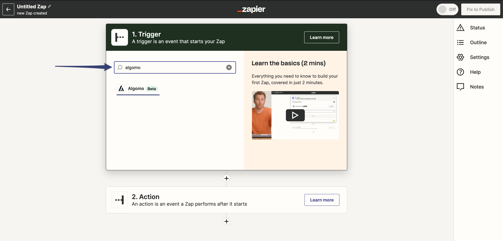

## Connecting Algomo to Zapier

Now that you have a Zapier account, you can connect your Algomo account to Zapier and start building Zaps.

### Step 1: Navigate to the Integrations Tab

Navigate to your Algomo dashboard and click on the **"Integrations"** tab in the left sidebar. Then click the Zapier card to open the Zapier integration modal.

### Step 2: Start the Integration

Clicking the Integration card will open a modal with a **"Start Integration"** button. Click on the button to connect your Algomo account to Zapier. This will redirect you to the Zapier website.

### Step 3: Create a Zap

Navigate to your Zapier dashboard and click on the **"Create Zap"** button to create your first Zap.

### Step 4: Choose a Trigger App

In the **"Choose a Trigger App"** search box, type "Algomo" and select the latest Algomo app from the search results.

### Step 5: Choose a Trigger Event

In the **"Choose Trigger Event"** search box, type the event you wish to use as a trigger and select it from the search results. (For example, "New Contact")

### Step 6: Connect Your Algomo Account

Click on the **"Sign in"** button to connect your Algomo account to Zapier.

### Step 7: Generate an Access Token

This will open a new window requesting your Access token. Navigate back to your Algomo zapier page and generate an Access token.

Copy the Access token and paste it in the Zapier window. Then click on the "Yes, Continue to Algomo" button.

**Congratulations, now you have access to all of your Algomo data and can start building Zaps to automate tasks and connect Algomo with other applications.**

### Step 8: Test Your Trigger

Click on the **"Test Trigger"** button to test your trigger. This will fetch the latest data from your Algomo account and display it in the Zapier window.
Once you're satisfied with the data, click on the **"Continue to selected record"** button to proceed.

### Step 9: Choose an Action App

In the **"Choose an Action App"** search box, type the application you wish to use as an action and select it from the search results. (For example, **"Slack"**)

### Step 10: Choose an Action Event

In the **"Choose Action Event"** search box, type the event you wish to use as an action and select it from the search results. (For example, **"Send Channel Message"**)

### Step 11: Connect Your Action Account

Click on the **"Sign in"** button to connect your action account to Zapier.

### Step 12: Customise Your Action

Customize your action by filling in the required fields. (For example, **"Channel"** and **"Message Text"**)

### Step 13: Test Your Action

Click on the **"Test"** button to test your action. This will send a message to the channel you specified in the previous step. Review the message and change it if necessary. Then click on the **"Restest action"** until you're happy. Then press the **"Publish"** button to finish.

Congratulations, you've just created your first Zap! Now you can create more Zaps to automate tasks and connect Algomo with other applications.
