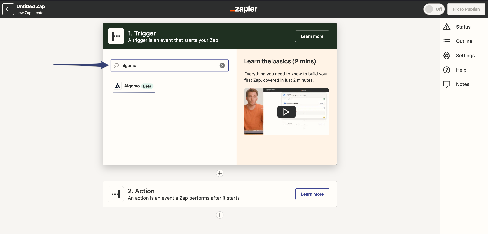
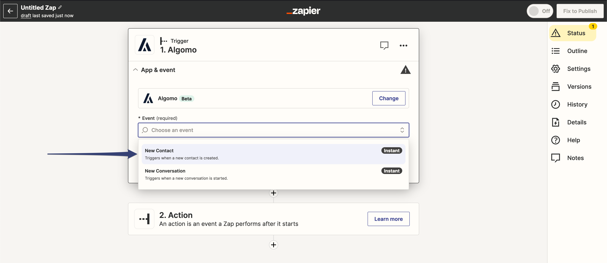
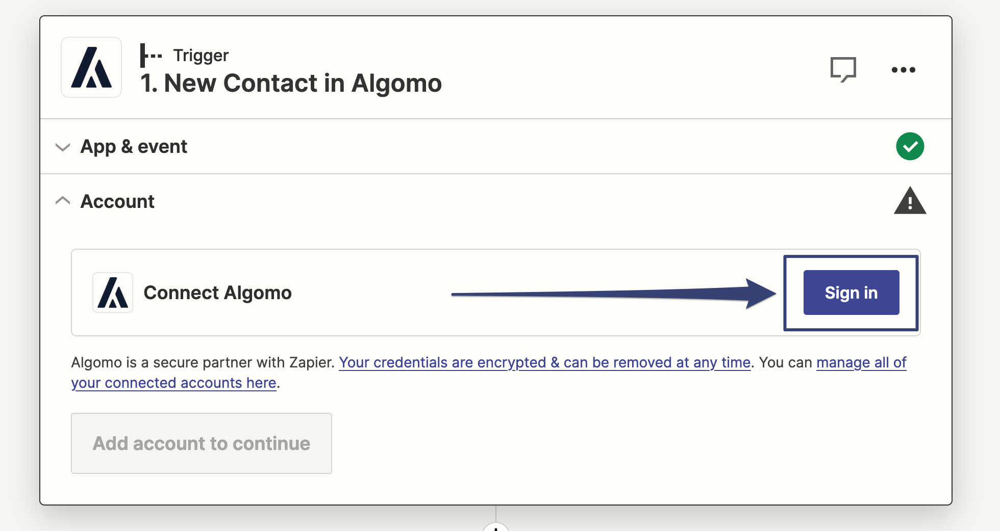

Now that you have a Zapier account, you can connect your Algomo account to Zapier and start building Zaps.

### Step 1: Navigate to the Integrations Tab

Go to [Algomo](https://app.algomo.com) > [Integrations](https://app.algomo.com/integrations) > [Zapier Integration](https://app.algomo.com/integrations/zapier)

### Step 2: Start the Integration

Clicking the Integration card will open a modal with a **Start Integration** button. Click on the button to connect your Algomo account to Zapier. This will redirect you to the Zapier website.

### Step 3: Create a Zap

On the new [Zapier](https://zapier.com/) tab go to [Dashboard](https://zapier.com/app/dashboard) and click on the **Create Zap** button to create your first Zap.

### Step 4: Choose a Trigger App

In the **Choose a Trigger App** search box, type "Algomo" and select the latest Algomo app from the search results.

### Step 5: Choose a Trigger Event

In the **Choose Trigger Event** search box, type the event you wish to use as a trigger and select it from the search results. (For example, "New Contact")

### Step 6: Connect Your Algomo Account

Click on the **Sign in** button to connect your Algomo account to Zapier.

### Step 7: Generate an Access Token

This will open a new window requesting your Access token. Navigate back to your Algomo zapier page and generate an Access token.

Copy the Access token and paste it in the Zapier window. Then click on the "Yes, Continue to Algomo" button.

---

**Congratulations!** Now you have access to all of your Algomo data and can start building Zaps to automate tasks and connect Algomo with other applications.
