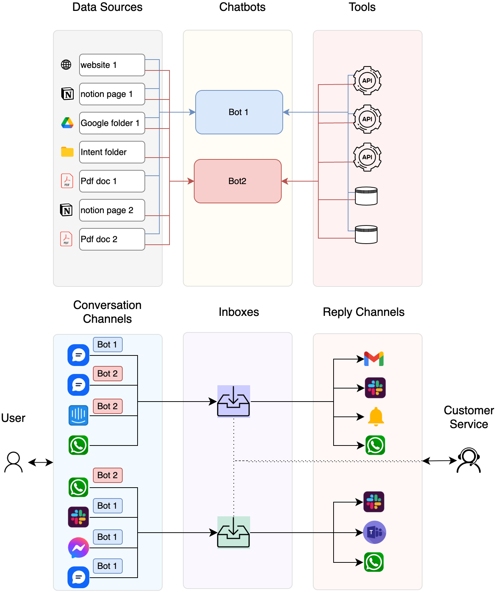

Algomo is a platform in which you can setup, design, automate and optimize your customer and employee support in 100+ languages, using generative AI.

Our technology can use your existing knowledge base, and APIs to engage in meaningful conversations, schedule appointments, make sales, build your database and many more.

### Architecture

The end-to-end flow of Algomo is the following:

1. The **user** sends a message to Algomo using any **conversation** **channels** you connect to. Conversations can be initiated through Algomo’s Chat Widget, Facebook Messenger, Viber, and many more channels.
2. All conversations from a channel are forwarded to an **inbox**, where they are assigned to a **human agent**, or by a **chatbot.**
3. A chatbot can reply to every message based on information found in **data** **sources**, and live information that can be found in **tools**
4. A **data source** can be the content of a public website, notion pages (like this one!), docx files, **intents,** pdfs, and many other documents
5. **A tool** is a programmatic way for the chatbot to interact with a company’s or external systems, for example, ordering a pizza.

### Why Algomo?

- **Multilingual** : Algomo is a powerful multilingual platform, capable of delivering personalized customer experiences in over 100 languages. Its unique technology fully automates customer service in 109 languages, making multilingual AI accessible on a global scale.
- **Data Integrations**: Algomo integrates data from a wide variety of sources into personalized customer responses. These sources include support articles, past conversations, PDFs, URLs, Notion pages, Word documents, and more.
- **Omnichannel Self-Service platform**: Algomo offers a comprehensive omnichannel self-service experience on various communication platforms. These include WhatsApp, Facebook Messenger, and Algomo’s own chat widget, providing customers with the flexibility to choose their preferred mode of communication.
- **AI Assistance and Screen Sharing**: Algomo enhances agent productivity by providing AI suggestions and enabling live screen sharing. This feature not only helps to speed up response times but also improves the quality of support provided.
- **Smart Assignment**: Algomo can seamlessly assign conversations to the appropriate specialist when human intervention is needed. This ensures that customers always get the help they need from the most suitable team member.
- **Multiple Reply Options with Live Translation**: Algomo allows agents to reply from various channels including Slack, Email, or the inbuilt Algomo inbox, which supports live translation. This feature enables real-time multilingual communication, making it easier for support teams to assist customers in their native languages.
