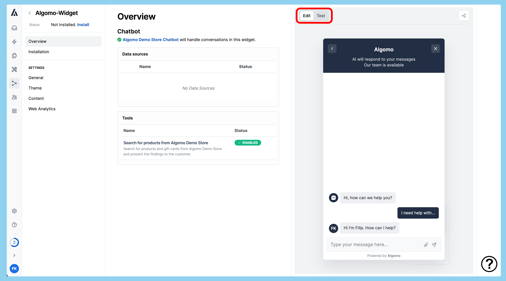

## Setup

### Install Algomo app in your Shopify Store

In order to use Shopify tools, you first need to install Algomo app in your Shopify store. If you already have it installed, you can skip this part.

1. Navigate to [Algomo app in Shopify App Store](https://apps.shopify.com/algomo) and click "Install".

2. You will be redirected to the Shopify admin panel. Click "Install".

3. Once installed, you will be redirected to the [Shopify integration settings in Algomo](https://app.algomo.com/integrations/shopify).

### Create a tool

1. Navigate to [Tools in Algomo](https://app.algomo.com/tools).
2. Click "New Tool" and select a tool type.

3. Select your Shopify store from the dropdown and click "Create".

### Activate the tool

In order to use the tool, you first need to create a chatbot and assign it to a widget. If you already have a chatbot and a widget, you can skip to step 4.

1. Navigate to [Chatbots in Algomo](https://app.algomo.com/chatbots), click "New Chatbot", pick a name and a company name the chatbot will respresent, and click "Create Chatbot".
2. Navigate to [Widgets in Algomo](https://app.algomo.com/widgets), click "New Widget", pick a name, and click "Create Widget".
3. In the widget settings, navigate to the "General" tab, select the chatbot you created in step 1, and click "Save".
4. Navigate to [Tools in Algomo](https://app.algomo.com/tools), click the tool you created earlier, click "Assign to a chatbot", and select a chatbot.

### Test the tool

You can test the tool by talking to your chatbot.

1. Navigate to [Widgets in Algomo](https://app.algomo.com/widgets) and open the widget assigned to the chatbot which has the tool assigned.
2. Enter the test mode by clicking the "Test" button in the top right corner.

