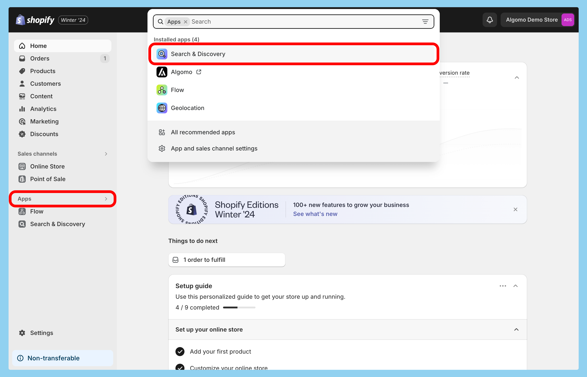
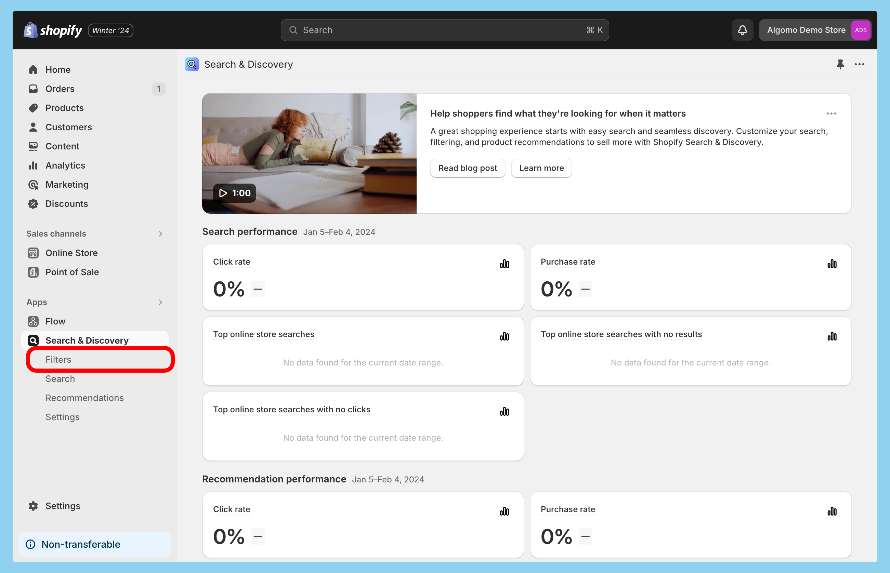
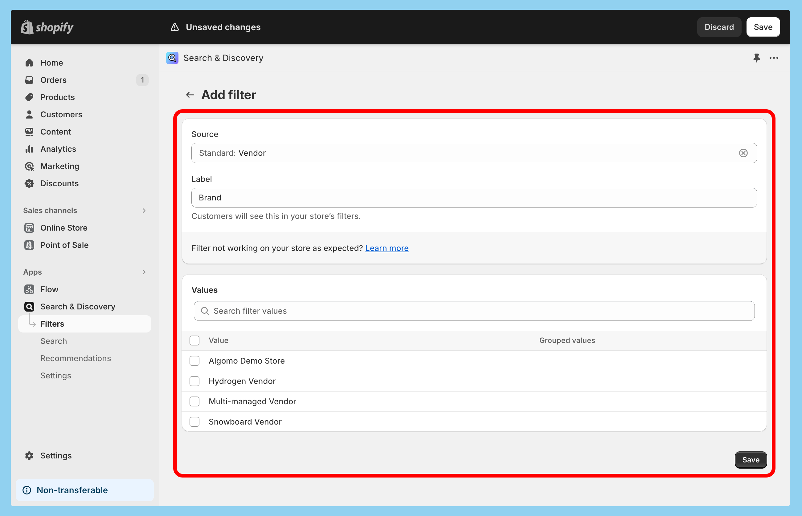
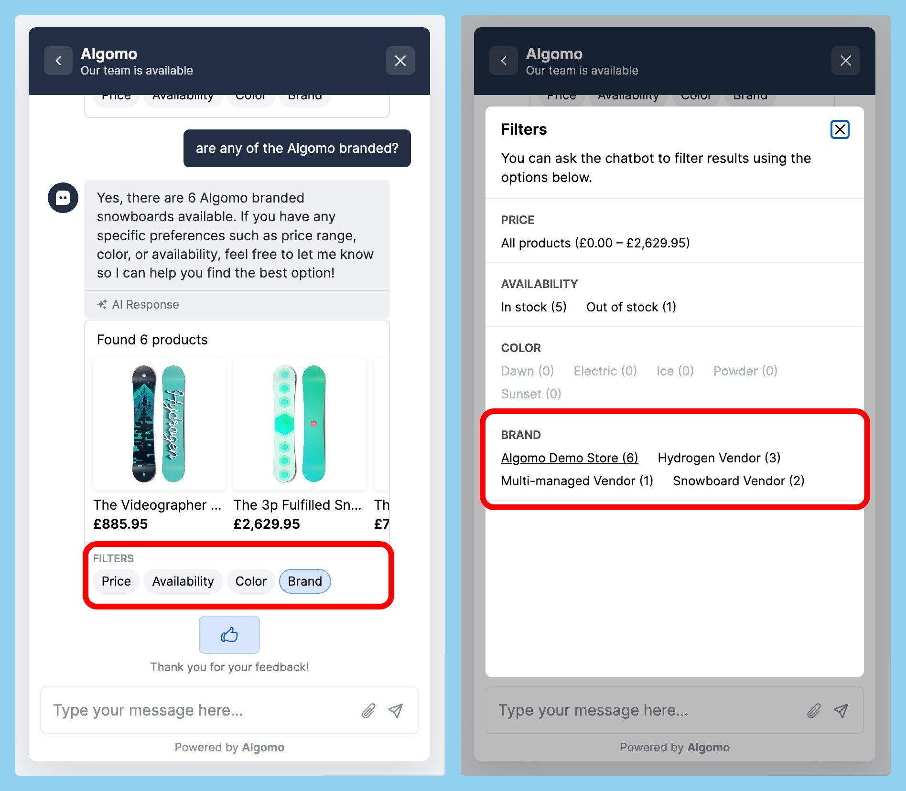

This tool combines search engine, recommendations engine and comparison engine into a cohesive experience of a smart shopping assistant.

It can help your customers make informed decisions faster by:

- providing product recommednations based on their needs,
- helping them discover what products are available,
- providing detailed information about products,
- and comparing products side by side.

## Overview

### Recommendations

Sometimes you're not sure which product you need. Our chatbot can recommend products based on user needs, using data available in your store.

<video controls width="100%">
  <source src="/media/recommendations.mp4" type="video/mp4" />
</video>

### Search

Once you know what kind of product you’re after, you can search for products from your store. Simply ask the chatbot about it. It will help you find the right product and provide you with detailed information about it.

<video controls width="100%">
  <source src="/media/search.mp4" type="video/mp4" />
</video>

#### Filters and sorting

Users can leverage filters in order to discover what types of products are available, narrow down the search and find exactly what they are looking for.

By default, two properties are available as filters: price range and availability. You can also add custom filters (see [Customisation](#customisation) section).

Additionally, users can sort the results by price.

### Comparison

You can enquire about product details included in descriptions and metadata, including custom metafields. This provides unique value to your customers, as they can arrive at a decision faster.

<video controls width="100%">
  <source src="/media/comparison.mp4" type="video/mp4" />
</video>

For 1-3 products, the chatbot can provide a side-by-side comparison of the main characteristics of the items using all the product data available, including description and metafields.

For a large number of products, the chatbot can provide a summary of the main characteristics of all the returned items.

## Customisation

### Custom filters

Chatbots using this tool have access to filters set up in your Shopify store. By default, they include price range and availability.

To provide better search experience, you can add custom filters through the official [Shopify Search & Discovery app](https://apps.shopify.com/search-and-discovery).

#### Adding filters

1. If not already done, install the [Search & Discovery app](https://apps.shopify.com/search-and-discovery). Follow the same steps as for the Algomo app (see [Install Algomo app in your Shopify Store](#install-algomo-app-in-your-shopify-store)).
2. Navigate to your [Shopify admin panel](https://admin.shopify.com/), click "Apps" in the left sidebar, and select "Search & Discovery" from the dropdown.

3. Once in the app, navigate to "Filters" in the left sidebar.

4. Click "Add filter", select filter source and set a label. You can select which filter values will be available, as well as combine them into groups.

5. Click "Save".

Now, your chatbot will be able to use these filters and will display them in the search results:

#### Custom filters

You might want to expose custom filters to your customers, for example dimensions or color. You can do this by creating metafields and enabling them as filters via Search & Discovery app. See [Custom metadata](#custom-metadata) section below for more information.

### Custom metadata

Chatbots using this tool have access to [product metafields](https://help.shopify.com/en/manual/custom-data/metafields) and can use them to provide detailed information about products and compare products side by side.

Providing custom metadata for the chatbot to use is as simple as adding metafields to your products in Shopify. For example, you can add a "back in stock date" metafield to your products, which will enable your chatbot to provide this information to your customers.

Refer to this guide on how to add metafields to your products: [Shopify Help Center: Metafields tutorial](https://help.shopify.com/en/manual/custom-data/metafields/using-metafields).

## Troubleshooting

### I’m asking for a product that exist but the chatbot can’t find it

We use Shopify Search API to find products in your store. If the product exists, but the chatbot can’t find it, it’s likely that the search settings in your store are not set up correctly.

Try going to your store website and searching for the same product. If it also doesn't provide satisfactory results, you should consider adding synonyms to the product title, via the [Search & Discovery app](https://apps.shopify.com/search-and-discovery).

Refer to this guide on how to add synonyms to your products: [Shopify Help Center: Modifying search](https://help.shopify.com/en/manual/online-store/search-and-discovery/search).

If the search settings are set up correctly, but the chatbot still can’t find the product, please contact us.

### Links in product cards are not working

In order for the links to work, your store must **not** be a password-protected or a development store. If it is, the chatbot will not be able to access product URLs.

## Frequently Asked Questions

### Does the tool use live data, or do I need to update it manually?

There is no need to update the data manually. The tool uses live data from your Shopify store. While some changes might take a few minutes to propagate, the chatbot will always provide the most up-to-date information.

### How can I provide back in stock date information to my customers?

You can add a custom metafield to your products in Shopify. The chatbot will be able to access that data automatically and provide it to your customers. See [Custom metadata](#custom-metadata) section for more information.
