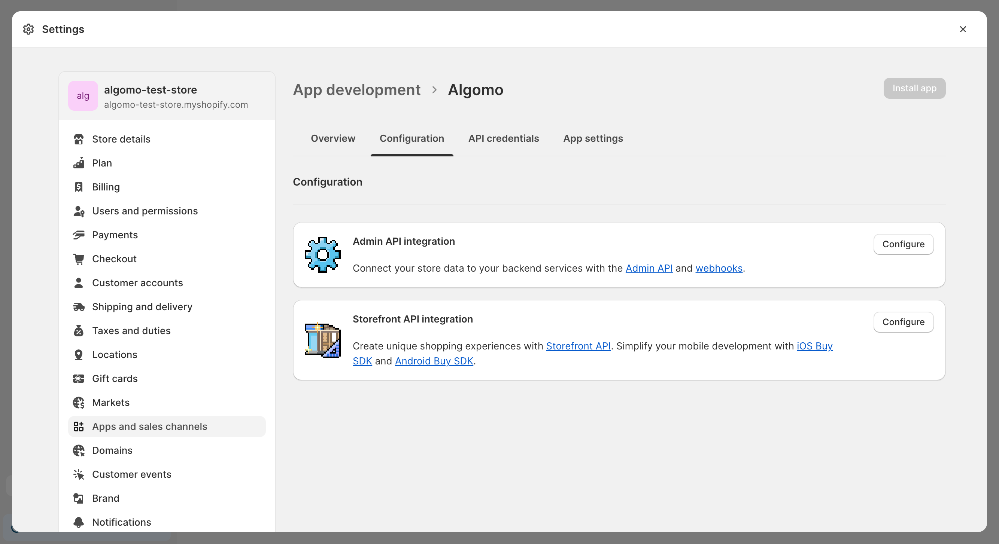
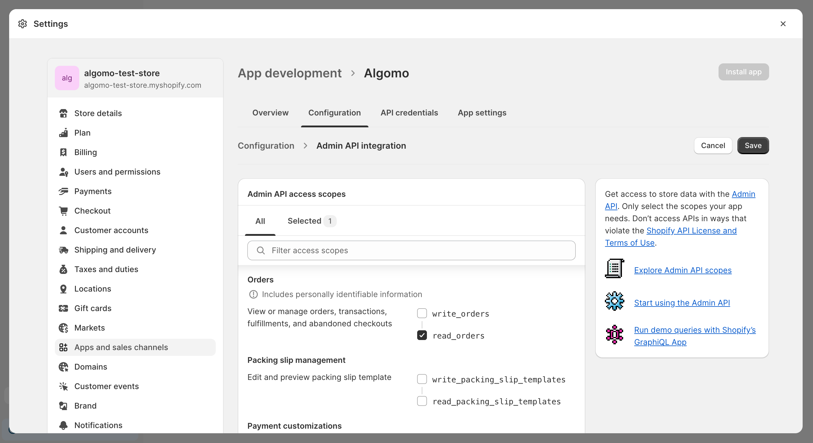
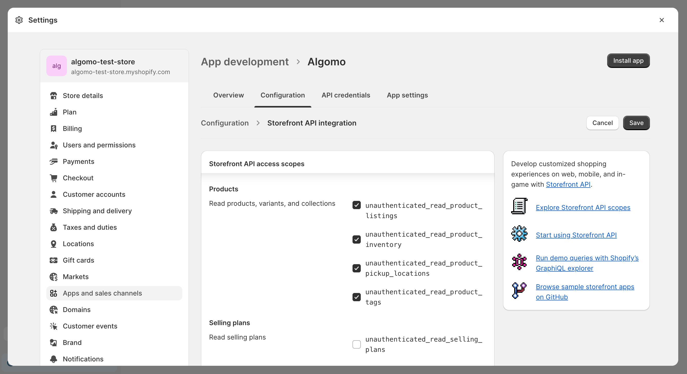

:::info
Tools are an experimental feature and they are in closed beta. If you are interested in using tools or you are having issues, please contact us at.
:::

Shopify tools enable chatbots to interact with your Shopify stores.

## Types of Tools

### Shopify Product Search

This tool allows chatbots to search for products in your Shopify store.

Your customers can specify what products they are looking for and the chatbot will return the most relevant results. Additionally, a price range can be specified to narrow down the search results.

### Shopify Order Status

This tool allows chatbots to check the status of orders in your Shopify store.

Your customers can specify their email and order number and the chatbot will return the status of the order.

## Setup

First, you need to create a Shopify app in order to obtain an API access key.

### Create a Shopify app

1. In you Shopify admin panel, navigate to ["Apps" → "Apps and sales channels" → "Develop apps"](https://admin.shopify.com/settings/apps/development).
2. Create an app by clicking "Create an app" in the top right corner.

If you haven't created development apps before, you will first need to allow development apps in your store.

### Configure the app

In your app settings navigate to the "Configuration" tab:

#### Admin API configuration

1. Under "Admin API integration" section click "Configure".
2. Select `read_orders` scope.
3. Click "Save".

#### Storefront API configuration

1. Under "Storefront API integration" section click "Configure".
2. Selected all scopes under "Products" section:
   - `unauthenticated_read_product_listings`
   - `unauthenticated_read_product_inventory`
   - `unauthenticated_read_product_pickup_locations`
   - `unauthenticated_read_product_tags`
3. Click "Save".

### Install the app

1. Click "Install app" in the top right corner and confirm the installation.
2. This action will generate an Admin API access token. Click "Reveal token once" and copy it.

:::caution
The token will be shown only once. Make sure to copy it and store it in a safe place, as it can be used for multiple Shopify tools. To obtain a new key, you will have to reinstall the app.
:::

### Create a tool

1. Navigate to the ["Tools" section in Algomo](https://app.algomo.com/tools).
2. Click "New Tool" in the top right corner and pick a Shopify tool you want to create.
3. In the form enter required details:
   - Store name
   - Store URL (the one ending with ".myshopify.com")
   - API access key

See ["Setup"](#setup) section for instructions on how to obtain the API access key.
