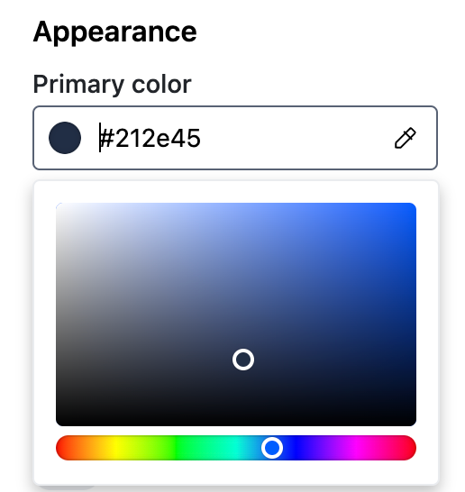
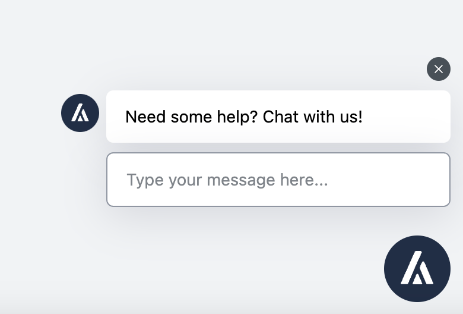
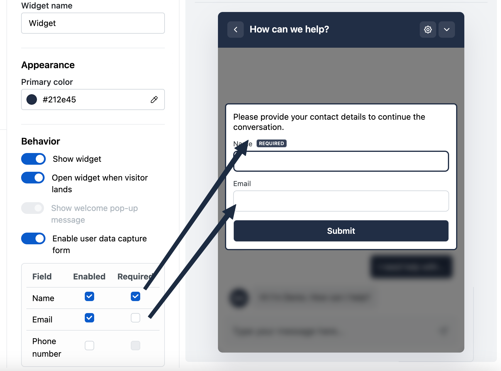
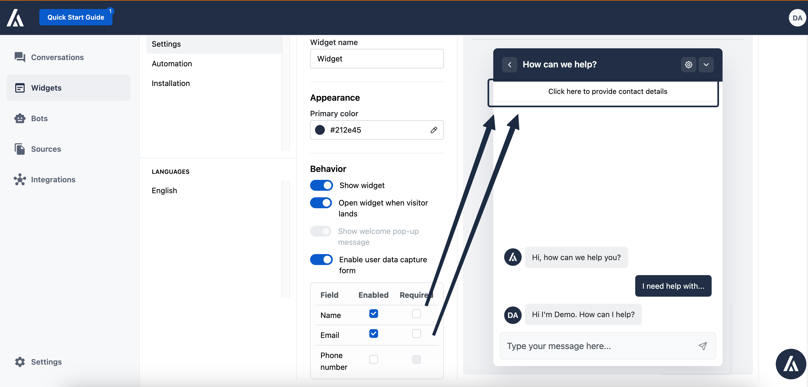

In the settings page please keep the `edit` mode on the widget so that you can see live any stylistic or behavioural changes

## 1. Appearance

You can change the primary color of the widget

## 2. Behaviour

### 1. Show widget

This options lets you select whether you want to show or not the widget on the website.

This is pretty key, as if you dont need to uninstall the widget from your website if you dont want your visitors to interact with it, but rather disable this toggle

### 2. Open widget when visitor lands

1. If enabled, the widget will by default be open for every new visitor of the website
2. If disabled then you can select to either show a welcome pop-up message or not

   1. If you select to show the welcome pop-up message, the a pop-up message will appear on top of the chat bubble like this one. To change the messaging, you will need to pick the welcome message for the languages you care about on the ‘languages’ section on the widget setting

      

   2. Otherwise, no popup message will appear

### 3. Enable user data capture form

This is used to collect sales leads. You can enable your widget to collect the name and email of every user. If you pick the required, then your visitors will need to fill in these details in order to start the conversation.

If they are not required, the user will always be having the option to fill in the required details with a soft prompt on the widget

These details are saved can be viewed in either each conversation page or the contacts pages
