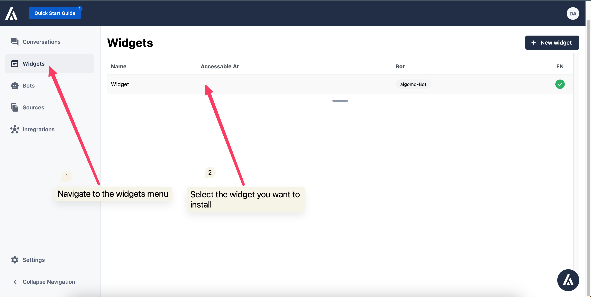
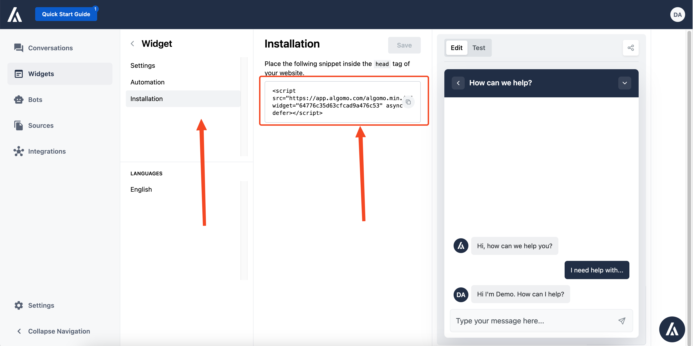

## Step 1: Get your widget Embed Script code

Firstly click on widgets and then select the widget you want to install

Once you get to your widget get to the installation tab and from there, copy the installation script

## Step 2: Install the javascript snippet in your website

You can generally do this by opening your site's HTML code and pasting the embed code inside the `head` tag of your website.

For installation on the most popular website builders please refer to the below guides

<ul>
<li style={{
    display: "flex",
    alignItems: "center",
    justifyContent: "flex-start",
    padding: "0.5rem",
    border: "1px solid #ccc",
    borderRadius: "5px",
    marginBottom: "1rem"
}}>

[Webflow](/docs/widgets/websites-builder/Webflow)

</li>

<li style={{
    display: "flex",
    alignItems: "center",
    justifyContent: "flex-start",
    padding: "0.5rem",
    border: "1px solid #ccc",
    borderRadius: "5px",
    marginBottom: "1rem"
}}>

[WordPress](/docs/widgets/websites-builder/WordPress)

</li>
</ul>

<!-- [Wix](/)

[Shopify](/)

[Drupal](/)

[Weebly](/)

[Magento](/)

[Squarespace](/)

[GoDaddy](/) -->

Make sure to save your changes and test the chat widget to ensure it's working correctly.
