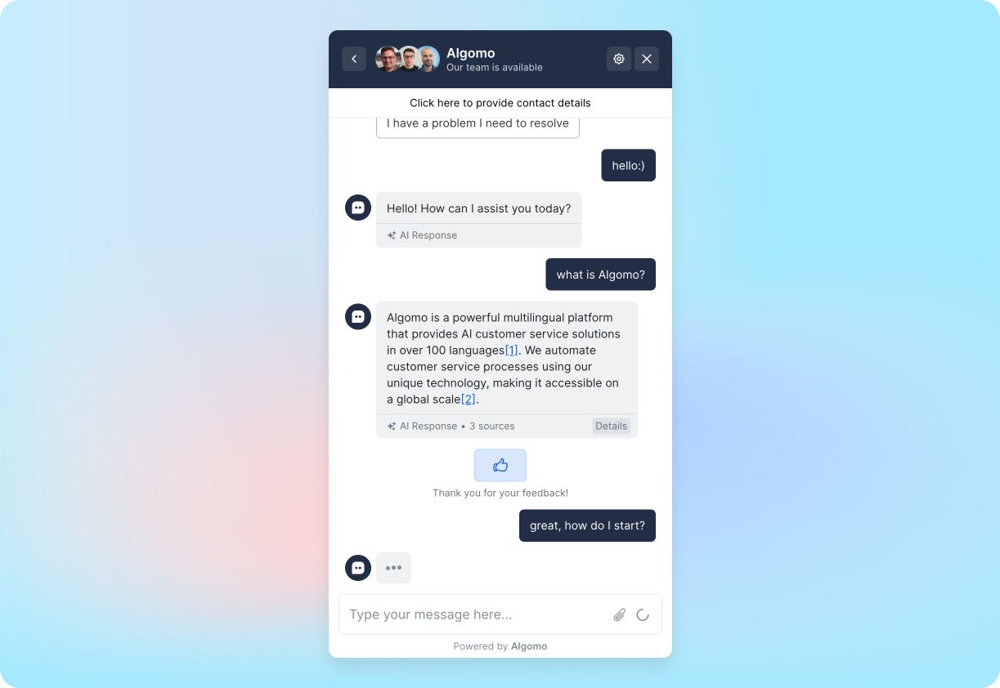

A widget (a.k.a ‘chatbox’, ‘webchat’, ‘messenger’) is the UI element where your visitors will interact with algomo if you install it on a website.

<!-- ![Widget](./images/Untitled.png -->

In the widget, there are two roles,

1. **User** – a website visitor or an employee
2. **Agent** – either a **human** or a **chatbot**
