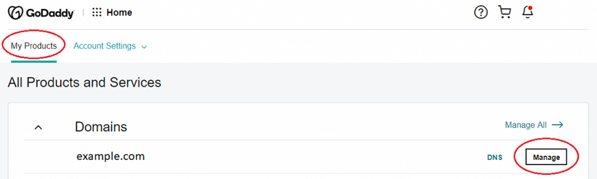

## Step 1

Log in to your GoDaddy account

Then click the **My Products** under the account user dropdown option at the top

Under the "All Products and Services" section, you can see the "Websites" section. Click **Manage** under your websites

## Step 2: Add Website

Then Click **Add Website** or sometimes it will be **Edit Website** in the Website Builder and start editing

## Step 3: Add Section

Now Click the **PAGE** section and select the page you want to add the Algomo live chat and then select the **Add Section**

## Step 4: Choose "HTML" and click "Add" button

## Step 5: Add livechat script

Now, paste your Algomo live chat code snippet in the Custom Code field

After pasting the "Custom Code" field, you can specify a height for the chat widget iframe in the "Forced Height" section. Now, click **Done** at the top of the website builder panel

Click **Preview** or **Publish** at the top of the panel, you can now view the Algomo live chat widget on your GoDaddy website
