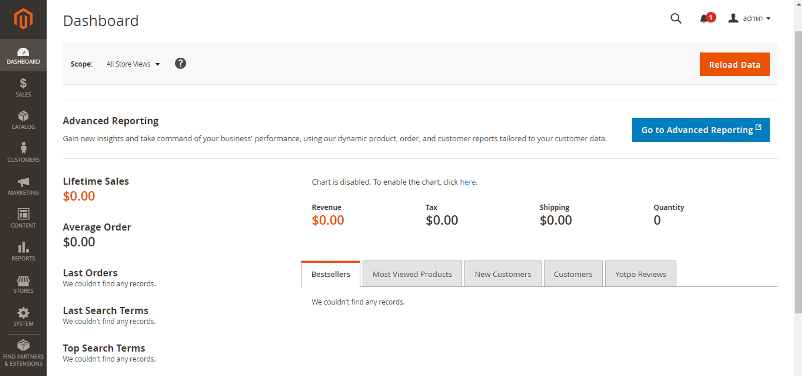

# Magento

### **Step 1: Login to your Magento admin panel**

### **Step 2: Open the Configuration**

From the left navigation panel, click the **CONTENT** option, and it will show a list of options under the "Design" section. Then click the **Configuration** option.

### **Step 3: Open Edit menu**

You’ll be navigating to the "Design Configuration" page. You would be able to see the list of your stores. Click the **Edit** option for the "Default Store View."

### **Step 4: Make changes in Footer**

Click the **Footer** option on the default store view page.

Open your Magento website, and the Algomo chat widget will be loaded along with your Magento bot.
