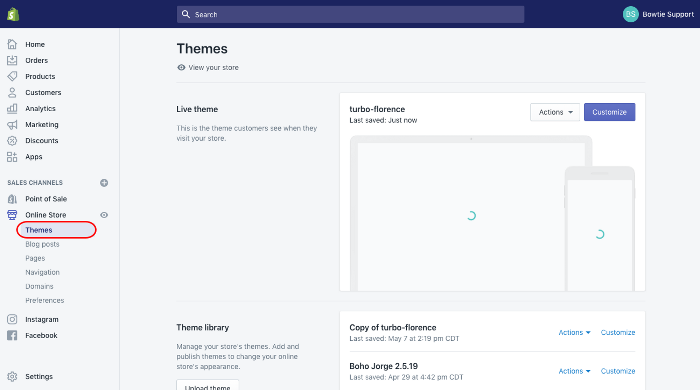

# Shopify

### **Adding your widget to Shopify Page**

1. Log in to Shopify, and go to the "Themes" tab.

    
2. Click on **Actions**, then select **Edit Code**.

3. Select the **theme.liquid** file.

    
4. Insert your Algomo widget chat code just before the `</body>` tag, then **save**.

