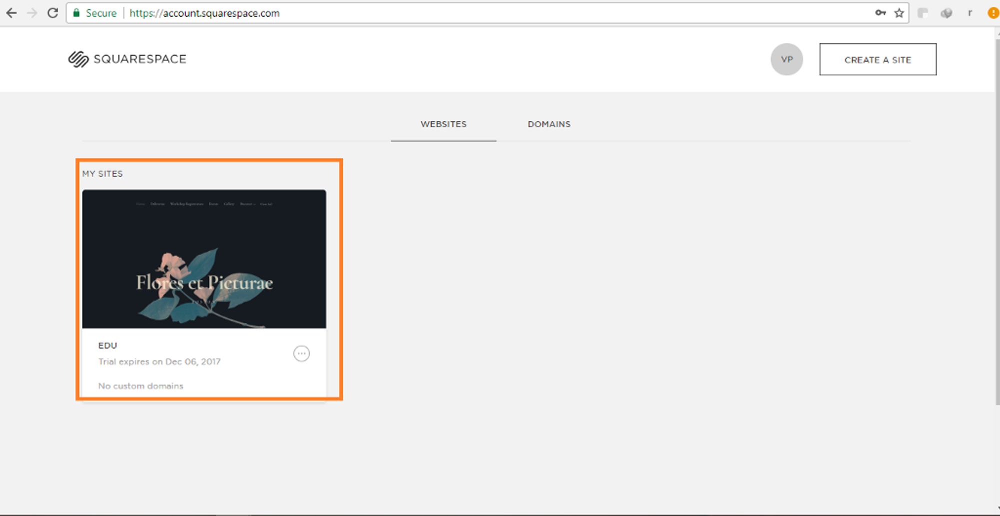

# Squarespace

### **Step 1: Log in to your account and select your website**

Visit Squarespace and login to your account. Under "Website" tab, click the website in which you want to add the live chat plugin.

### **Step 2: Open settings**

Choose **Settings** from the left navigation panel.

### **Step 3: Open advanced settings**

Next, navigate to the "Website" section and Click on **Advanced** to open advanced settings.

### **Step 4: Open code injection console**

From the advanced settings menu, open **Code Injection** console.

### **Step 5: Insert your plugin script**

Paste the copied javascript code the footer section.

Click **Save** and you are good to go!