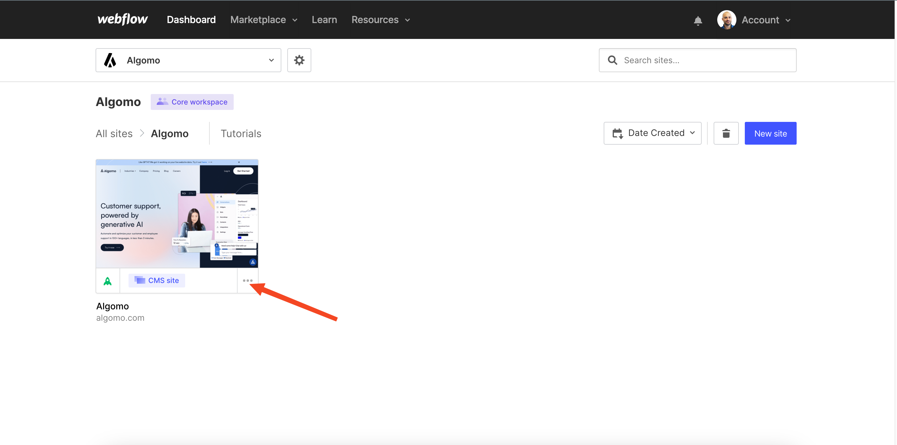

Embedding a chat widget for Webflow is a simple process that can be completed in a few easy steps. There are two ways to do it:

## Embed in a specific webpage

### Embed in the whole website

Select the site you want to install algomo in and click on the three dots

Then click on settings

Navigate to the custom code section and the add the widget embed code in the ‘head code’ section. Don’t forget to publish your changes

### Embed in a specific webpage

1. Log into your Webflow account, and make sure you are on a premium subscription plan on Webflow as this is the only way where you can get access to the ‘embed’ function.
2. Navigate to the page where you want to embed the widget.
3. Add an Embed element: In the Elements panel, click on the Embed element and drag it to the location on the page where you want to embed the widget.
4. Paste the widget's code: Double-click on the Embed element to open the code editor. Paste the widget's code into the editor and click the Save button.
5. Preview the page: Click the Preview button to preview the page and make sure the widget is displaying correctly.

That's it! You have successfully embedded a chat widget on your Webflow site. Visitors to your site can now use the chat widget to get in touch with you.
