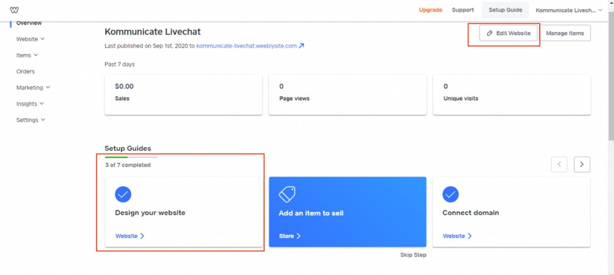

## Step 1: Log in to your Weebly account

Log in to your Weebly account and open your "Weebly console".

## Step 2: Open the Edit/Design section

Click on the **Edit Website** button or **Design your website** option; it will show all the website pages.

## Step 3: Add Section

Locate the "Add Section" option and open it.

## Step 4: Open the Embed Code Section

Locate the "Embed Code" section in your console and select the “Embed code” page section.

Then paste your Algomo live chat code snippet in the Embed code section, as shown in the image below.

## Step 5: Publish Your Website

Now navigate back to your Weebly console and click on **Preview** or **Publish** at the top of the panel. You will be able to see your chat widget there.
