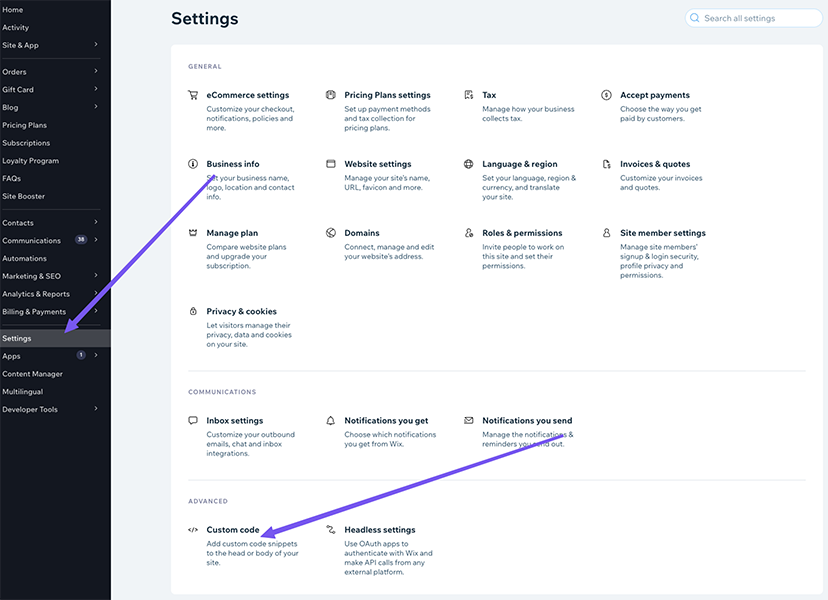

## Adding custom code to your site

**Important:**

Before you begin, make sure that your site is [published](https://support.wix.com/en/article/publishing-your-site-6980885) and has a [connected domain](https://support.wix.com/en/article/connecting-a-domain-to-your-site).

1. Go to [Settings](https://www.wix.com/my-account/site-selector/?buttonText=Open%20Settings&title=Select%20a%20Site&autoSelectOnSingleSite=true&actionUrl=https://www.wix.com/dashboard/{{metaSiteId}}/settings) in your site's dashboard.

2. Click the **Custom Code** tab in the "Advanced" section.

3. Click **Add Custom Code** at the top right.
4. Paste the code snippet in the text box.
5. Enter a name for your code. `(Algomo chatbot)`

6. Select an option under **Add Code to Pages**:
   ◦ **All pages:**
7. Choose where to place your code under **Place Code in:**
   ◦ **Head**
8. Click **Apply**.

**Notes:**

- Your code snippets are associated with a specific domain. If you [assign a different domain to your site](https://support.wix.com/en/article/assigning-a-domain-to-your-wix-site), your code snippets will be deleted. There is no need to add code snippets to your secondary domain, as all traffic is redirected to your primary domain.
- To help your site be compliant with privacy laws such as the [GDPR](https://support.wix.com/en/article/preparing-your-wix-site-for-the-gdpr), we recommend you [categorize your custom code](https://support.wix.com/en/article/categorizing-your-custom-code).
