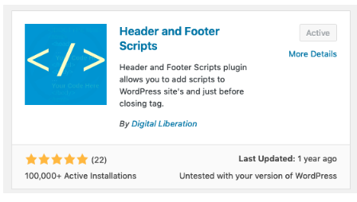

Log in to your WordPress account, and then:

1. Go to the Dashboard.
2. Click **Plugins > Add New**.
3. Search for "Header and Footer Scripts."

   

4. Install the "Header and Footer Scripts" plugin, then click **Activate**.
   - After installation, you'll see a Header and Footer Scripts menu under Settings.
5. Paste your chat widget code into the "Scripts in Footer" box, then click **Save**

   
