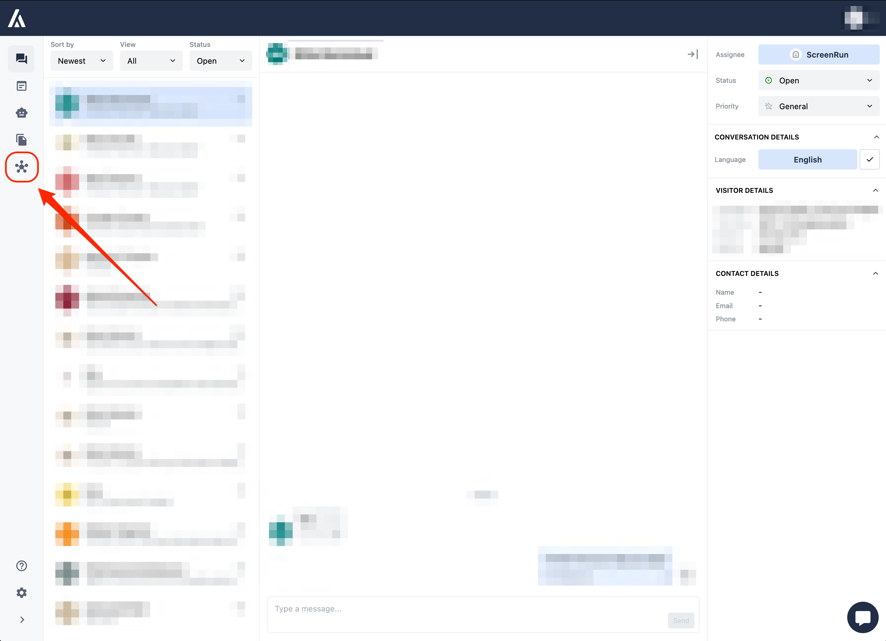
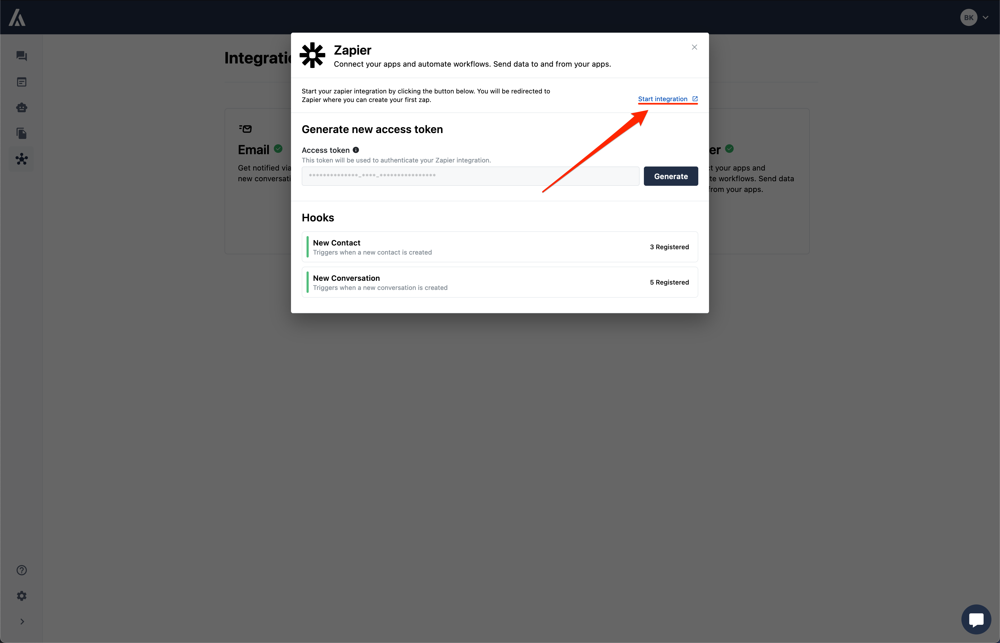
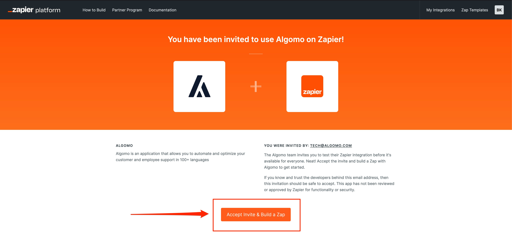

### Connecting Algomo to Zapier

Now that you have a Zapier account, you can connect your Algomo account to Zapier and start building Zaps.

#### Step 1: Navigate to the Integrations Tab

Navigate to your Algomo dashboard and click on the "Integrations" tab in the left sidebar. Then click the Zapier card to open the Zapier integration modal.

#### Step 2: Start the Integration

Clicking the Integration card will open a modal with a "Start Integration" button. Click on the button to connect your Algomo account to Zapier. This will redirect you to the Zapier website.

#### Step 3: Accept the Invite

In the Zapier website, click on the "Accept Invite & Build a Zap" button to accept the invite and start building your first Zap.

If you are not logged in, you will be prompted to log in to your Zapier account.

**Congratulations!** You have successfully connected your Algomo account to Zapier. Now you can start building Zaps to automate tasks and connect Algomo with other applications.
