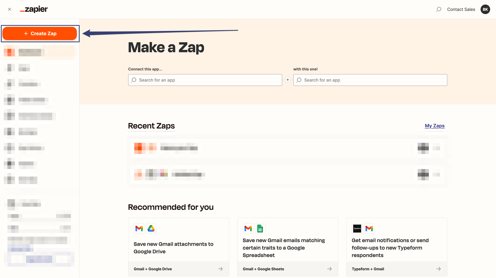
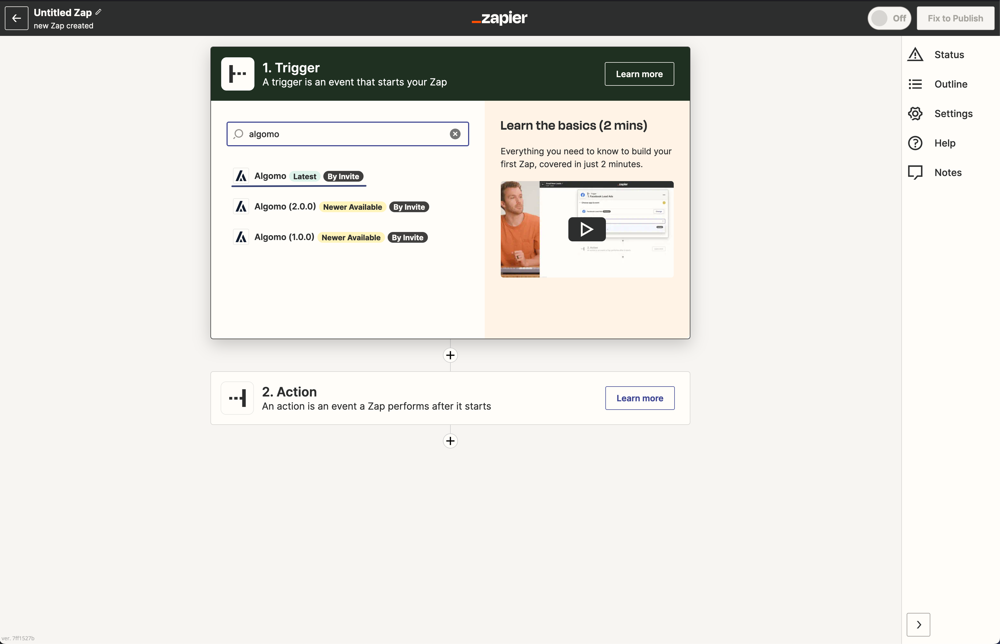

1. Navigate to your Zapier dashboard and click on the "Create Zap" button to create your first Zap.

5. In the "Choose a Trigger App" search box, type "Algomo" and select the latest Algomo app from the search results.

1. In the "Choose Trigger Event" search box, type "New Conversation" and select the "New Conversation" trigger event from the search results. (Note: You can also Choose any of the Algomo trigger event to create a Zap that triggers when a new that event occurs.)
