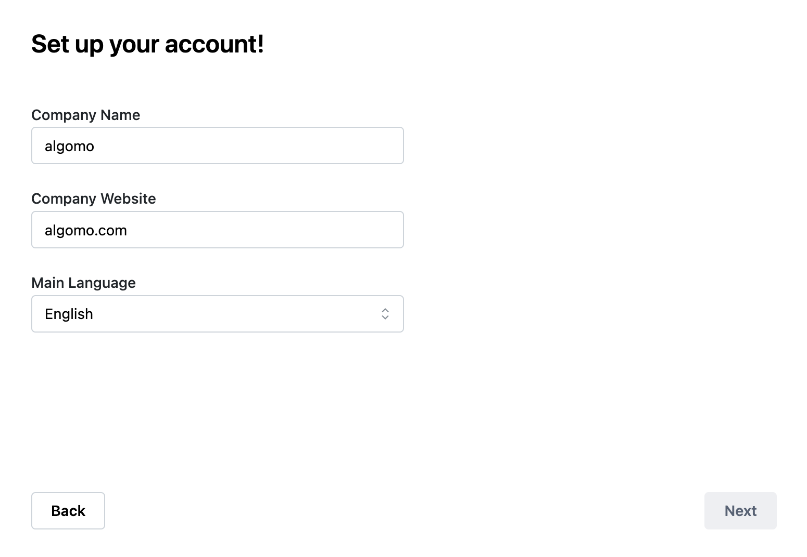

1. In the onboarding, you’ll be asked to provide your company’s name (eg Algomo), your website (algomo.com), and preferred automation language:

2. Once you complete this, you will be redirected to a page where the chatbot will autogenerate responses to two questions based on content found in your website. These two questions are the first two intents.

This information is enough for us to create

- Your first **two intents** (’What is algomo’, ‘how can I contact algomo’)
- Your first **data source** (the URL of your website, eg ‘algomo.com’)
- Your first **chatbot** (eg algomo-Chatbot), based on the two intents and data source created above
- Your first **widget** (eg algomo-widget), which used the first chatbot that you just created.
